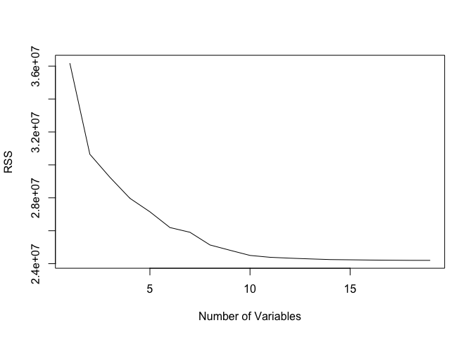
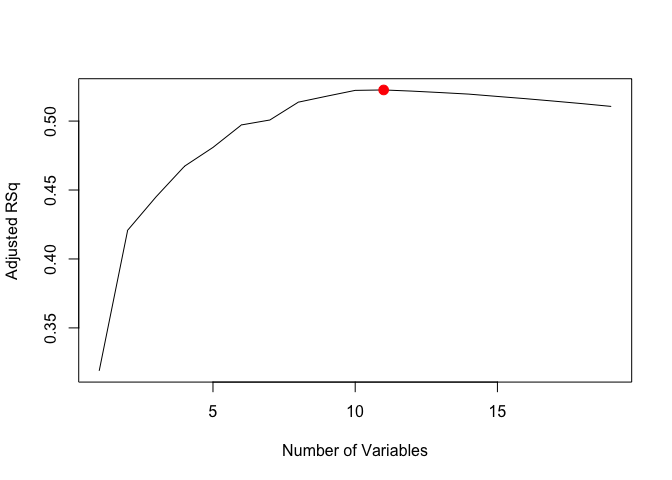

# Feb_20_2018_KN
Kazu  
2/20/2018  


```r
# Chapter 6 Lab 1: Subset Selection Methods

# Best Subset Selection
fix(Hitters)
names(Hitters)
```

```
##  [1] "AtBat"     "Hits"      "HmRun"     "Runs"      "RBI"      
##  [6] "Walks"     "Years"     "CAtBat"    "CHits"     "CHmRun"   
## [11] "CRuns"     "CRBI"      "CWalks"    "League"    "Division" 
## [16] "PutOuts"   "Assists"   "Errors"    "Salary"    "NewLeague"
```

```r
dim(Hitters)
```

```
## [1] 322  20
```

```r
sum(is.na(Hitters$Salary))
```

```
## [1] 59
```

```r
Hitters=na.omit(Hitters)
dim(Hitters)
```

```
## [1] 263  20
```

```r
sum(is.na(Hitters))
```

```
## [1] 0
```

```r
library(leaps)
regfit.full=regsubsets(Salary~.,Hitters)
summary(regfit.full)
```

```
## Subset selection object
## Call: regsubsets.formula(Salary ~ ., Hitters)
## 19 Variables  (and intercept)
##            Forced in Forced out
## AtBat          FALSE      FALSE
## Hits           FALSE      FALSE
## HmRun          FALSE      FALSE
## Runs           FALSE      FALSE
## RBI            FALSE      FALSE
## Walks          FALSE      FALSE
## Years          FALSE      FALSE
## CAtBat         FALSE      FALSE
## CHits          FALSE      FALSE
## CHmRun         FALSE      FALSE
## CRuns          FALSE      FALSE
## CRBI           FALSE      FALSE
## CWalks         FALSE      FALSE
## LeagueN        FALSE      FALSE
## DivisionW      FALSE      FALSE
## PutOuts        FALSE      FALSE
## Assists        FALSE      FALSE
## Errors         FALSE      FALSE
## NewLeagueN     FALSE      FALSE
## 1 subsets of each size up to 8
## Selection Algorithm: exhaustive
##          AtBat Hits HmRun Runs RBI Walks Years CAtBat CHits CHmRun CRuns
## 1  ( 1 ) " "   " "  " "   " "  " " " "   " "   " "    " "   " "    " "  
## 2  ( 1 ) " "   "*"  " "   " "  " " " "   " "   " "    " "   " "    " "  
## 3  ( 1 ) " "   "*"  " "   " "  " " " "   " "   " "    " "   " "    " "  
## 4  ( 1 ) " "   "*"  " "   " "  " " " "   " "   " "    " "   " "    " "  
## 5  ( 1 ) "*"   "*"  " "   " "  " " " "   " "   " "    " "   " "    " "  
## 6  ( 1 ) "*"   "*"  " "   " "  " " "*"   " "   " "    " "   " "    " "  
## 7  ( 1 ) " "   "*"  " "   " "  " " "*"   " "   "*"    "*"   "*"    " "  
## 8  ( 1 ) "*"   "*"  " "   " "  " " "*"   " "   " "    " "   "*"    "*"  
##          CRBI CWalks LeagueN DivisionW PutOuts Assists Errors NewLeagueN
## 1  ( 1 ) "*"  " "    " "     " "       " "     " "     " "    " "       
## 2  ( 1 ) "*"  " "    " "     " "       " "     " "     " "    " "       
## 3  ( 1 ) "*"  " "    " "     " "       "*"     " "     " "    " "       
## 4  ( 1 ) "*"  " "    " "     "*"       "*"     " "     " "    " "       
## 5  ( 1 ) "*"  " "    " "     "*"       "*"     " "     " "    " "       
## 6  ( 1 ) "*"  " "    " "     "*"       "*"     " "     " "    " "       
## 7  ( 1 ) " "  " "    " "     "*"       "*"     " "     " "    " "       
## 8  ( 1 ) " "  "*"    " "     "*"       "*"     " "     " "    " "
```

```r
regfit.full=regsubsets(Salary~.,data=Hitters,nvmax=19)
reg.summary=summary(regfit.full)
names(reg.summary)
```

```
## [1] "which"  "rsq"    "rss"    "adjr2"  "cp"     "bic"    "outmat" "obj"
```

```r
reg.summary$rsq
```

```
##  [1] 0.3214501 0.4252237 0.4514294 0.4754067 0.4908036 0.5087146 0.5141227
##  [8] 0.5285569 0.5346124 0.5404950 0.5426153 0.5436302 0.5444570 0.5452164
## [15] 0.5454692 0.5457656 0.5459518 0.5460945 0.5461159
```

```r
par(mfrow=c(2,2))
plot(reg.summary$rss,xlab="Number of Variables",ylab="RSS",type="l")
plot(reg.summary$adjr2,xlab="Number of Variables",ylab="Adjusted RSq",type="l")
which.max(reg.summary$adjr2)
```

```
## [1] 11
```

```r
points(11,reg.summary$adjr2[11], col="red",cex=2,pch=20)
plot(reg.summary$cp,xlab="Number of Variables",ylab="Cp",type='l')
which.min(reg.summary$cp)
```

```
## [1] 10
```

```r
points(10,reg.summary$cp[10],col="red",cex=2,pch=20)
which.min(reg.summary$bic)
```

```
## [1] 6
```

```r
plot(reg.summary$bic,xlab="Number of Variables",ylab="BIC",type='l')
points(6,reg.summary$bic[6],col="red",cex=2,pch=20)
```

<!-- -->

```r
plot(regfit.full,scale="r2")
plot(regfit.full,scale="adjr2")
plot(regfit.full,scale="Cp")
plot(regfit.full,scale="bic")
```

<!-- -->

```r
coef(regfit.full,6)
```

```
##  (Intercept)        AtBat         Hits        Walks         CRBI 
##   91.5117981   -1.8685892    7.6043976    3.6976468    0.6430169 
##    DivisionW      PutOuts 
## -122.9515338    0.2643076
```
# Forward and Backward Stepwise Selection

```r
regfit.fwd=regsubsets(Salary~.,data=Hitters,nvmax=19,method="forward")
summary(regfit.fwd)
```

```
## Subset selection object
## Call: regsubsets.formula(Salary ~ ., data = Hitters, nvmax = 19, method = "forward")
## 19 Variables  (and intercept)
##            Forced in Forced out
## AtBat          FALSE      FALSE
## Hits           FALSE      FALSE
## HmRun          FALSE      FALSE
## Runs           FALSE      FALSE
## RBI            FALSE      FALSE
## Walks          FALSE      FALSE
## Years          FALSE      FALSE
## CAtBat         FALSE      FALSE
## CHits          FALSE      FALSE
## CHmRun         FALSE      FALSE
## CRuns          FALSE      FALSE
## CRBI           FALSE      FALSE
## CWalks         FALSE      FALSE
## LeagueN        FALSE      FALSE
## DivisionW      FALSE      FALSE
## PutOuts        FALSE      FALSE
## Assists        FALSE      FALSE
## Errors         FALSE      FALSE
## NewLeagueN     FALSE      FALSE
## 1 subsets of each size up to 19
## Selection Algorithm: forward
##           AtBat Hits HmRun Runs RBI Walks Years CAtBat CHits CHmRun CRuns
## 1  ( 1 )  " "   " "  " "   " "  " " " "   " "   " "    " "   " "    " "  
## 2  ( 1 )  " "   "*"  " "   " "  " " " "   " "   " "    " "   " "    " "  
## 3  ( 1 )  " "   "*"  " "   " "  " " " "   " "   " "    " "   " "    " "  
## 4  ( 1 )  " "   "*"  " "   " "  " " " "   " "   " "    " "   " "    " "  
## 5  ( 1 )  "*"   "*"  " "   " "  " " " "   " "   " "    " "   " "    " "  
## 6  ( 1 )  "*"   "*"  " "   " "  " " "*"   " "   " "    " "   " "    " "  
## 7  ( 1 )  "*"   "*"  " "   " "  " " "*"   " "   " "    " "   " "    " "  
## 8  ( 1 )  "*"   "*"  " "   " "  " " "*"   " "   " "    " "   " "    "*"  
## 9  ( 1 )  "*"   "*"  " "   " "  " " "*"   " "   "*"    " "   " "    "*"  
## 10  ( 1 ) "*"   "*"  " "   " "  " " "*"   " "   "*"    " "   " "    "*"  
## 11  ( 1 ) "*"   "*"  " "   " "  " " "*"   " "   "*"    " "   " "    "*"  
## 12  ( 1 ) "*"   "*"  " "   "*"  " " "*"   " "   "*"    " "   " "    "*"  
## 13  ( 1 ) "*"   "*"  " "   "*"  " " "*"   " "   "*"    " "   " "    "*"  
## 14  ( 1 ) "*"   "*"  "*"   "*"  " " "*"   " "   "*"    " "   " "    "*"  
## 15  ( 1 ) "*"   "*"  "*"   "*"  " " "*"   " "   "*"    "*"   " "    "*"  
## 16  ( 1 ) "*"   "*"  "*"   "*"  "*" "*"   " "   "*"    "*"   " "    "*"  
## 17  ( 1 ) "*"   "*"  "*"   "*"  "*" "*"   " "   "*"    "*"   " "    "*"  
## 18  ( 1 ) "*"   "*"  "*"   "*"  "*" "*"   "*"   "*"    "*"   " "    "*"  
## 19  ( 1 ) "*"   "*"  "*"   "*"  "*" "*"   "*"   "*"    "*"   "*"    "*"  
##           CRBI CWalks LeagueN DivisionW PutOuts Assists Errors NewLeagueN
## 1  ( 1 )  "*"  " "    " "     " "       " "     " "     " "    " "       
## 2  ( 1 )  "*"  " "    " "     " "       " "     " "     " "    " "       
## 3  ( 1 )  "*"  " "    " "     " "       "*"     " "     " "    " "       
## 4  ( 1 )  "*"  " "    " "     "*"       "*"     " "     " "    " "       
## 5  ( 1 )  "*"  " "    " "     "*"       "*"     " "     " "    " "       
## 6  ( 1 )  "*"  " "    " "     "*"       "*"     " "     " "    " "       
## 7  ( 1 )  "*"  "*"    " "     "*"       "*"     " "     " "    " "       
## 8  ( 1 )  "*"  "*"    " "     "*"       "*"     " "     " "    " "       
## 9  ( 1 )  "*"  "*"    " "     "*"       "*"     " "     " "    " "       
## 10  ( 1 ) "*"  "*"    " "     "*"       "*"     "*"     " "    " "       
## 11  ( 1 ) "*"  "*"    "*"     "*"       "*"     "*"     " "    " "       
## 12  ( 1 ) "*"  "*"    "*"     "*"       "*"     "*"     " "    " "       
## 13  ( 1 ) "*"  "*"    "*"     "*"       "*"     "*"     "*"    " "       
## 14  ( 1 ) "*"  "*"    "*"     "*"       "*"     "*"     "*"    " "       
## 15  ( 1 ) "*"  "*"    "*"     "*"       "*"     "*"     "*"    " "       
## 16  ( 1 ) "*"  "*"    "*"     "*"       "*"     "*"     "*"    " "       
## 17  ( 1 ) "*"  "*"    "*"     "*"       "*"     "*"     "*"    "*"       
## 18  ( 1 ) "*"  "*"    "*"     "*"       "*"     "*"     "*"    "*"       
## 19  ( 1 ) "*"  "*"    "*"     "*"       "*"     "*"     "*"    "*"
```

```r
regfit.bwd=regsubsets(Salary~.,data=Hitters,nvmax=19,method="backward")
summary(regfit.bwd)
```

```
## Subset selection object
## Call: regsubsets.formula(Salary ~ ., data = Hitters, nvmax = 19, method = "backward")
## 19 Variables  (and intercept)
##            Forced in Forced out
## AtBat          FALSE      FALSE
## Hits           FALSE      FALSE
## HmRun          FALSE      FALSE
## Runs           FALSE      FALSE
## RBI            FALSE      FALSE
## Walks          FALSE      FALSE
## Years          FALSE      FALSE
## CAtBat         FALSE      FALSE
## CHits          FALSE      FALSE
## CHmRun         FALSE      FALSE
## CRuns          FALSE      FALSE
## CRBI           FALSE      FALSE
## CWalks         FALSE      FALSE
## LeagueN        FALSE      FALSE
## DivisionW      FALSE      FALSE
## PutOuts        FALSE      FALSE
## Assists        FALSE      FALSE
## Errors         FALSE      FALSE
## NewLeagueN     FALSE      FALSE
## 1 subsets of each size up to 19
## Selection Algorithm: backward
##           AtBat Hits HmRun Runs RBI Walks Years CAtBat CHits CHmRun CRuns
## 1  ( 1 )  " "   " "  " "   " "  " " " "   " "   " "    " "   " "    "*"  
## 2  ( 1 )  " "   "*"  " "   " "  " " " "   " "   " "    " "   " "    "*"  
## 3  ( 1 )  " "   "*"  " "   " "  " " " "   " "   " "    " "   " "    "*"  
## 4  ( 1 )  "*"   "*"  " "   " "  " " " "   " "   " "    " "   " "    "*"  
## 5  ( 1 )  "*"   "*"  " "   " "  " " "*"   " "   " "    " "   " "    "*"  
## 6  ( 1 )  "*"   "*"  " "   " "  " " "*"   " "   " "    " "   " "    "*"  
## 7  ( 1 )  "*"   "*"  " "   " "  " " "*"   " "   " "    " "   " "    "*"  
## 8  ( 1 )  "*"   "*"  " "   " "  " " "*"   " "   " "    " "   " "    "*"  
## 9  ( 1 )  "*"   "*"  " "   " "  " " "*"   " "   "*"    " "   " "    "*"  
## 10  ( 1 ) "*"   "*"  " "   " "  " " "*"   " "   "*"    " "   " "    "*"  
## 11  ( 1 ) "*"   "*"  " "   " "  " " "*"   " "   "*"    " "   " "    "*"  
## 12  ( 1 ) "*"   "*"  " "   "*"  " " "*"   " "   "*"    " "   " "    "*"  
## 13  ( 1 ) "*"   "*"  " "   "*"  " " "*"   " "   "*"    " "   " "    "*"  
## 14  ( 1 ) "*"   "*"  "*"   "*"  " " "*"   " "   "*"    " "   " "    "*"  
## 15  ( 1 ) "*"   "*"  "*"   "*"  " " "*"   " "   "*"    "*"   " "    "*"  
## 16  ( 1 ) "*"   "*"  "*"   "*"  "*" "*"   " "   "*"    "*"   " "    "*"  
## 17  ( 1 ) "*"   "*"  "*"   "*"  "*" "*"   " "   "*"    "*"   " "    "*"  
## 18  ( 1 ) "*"   "*"  "*"   "*"  "*" "*"   "*"   "*"    "*"   " "    "*"  
## 19  ( 1 ) "*"   "*"  "*"   "*"  "*" "*"   "*"   "*"    "*"   "*"    "*"  
##           CRBI CWalks LeagueN DivisionW PutOuts Assists Errors NewLeagueN
## 1  ( 1 )  " "  " "    " "     " "       " "     " "     " "    " "       
## 2  ( 1 )  " "  " "    " "     " "       " "     " "     " "    " "       
## 3  ( 1 )  " "  " "    " "     " "       "*"     " "     " "    " "       
## 4  ( 1 )  " "  " "    " "     " "       "*"     " "     " "    " "       
## 5  ( 1 )  " "  " "    " "     " "       "*"     " "     " "    " "       
## 6  ( 1 )  " "  " "    " "     "*"       "*"     " "     " "    " "       
## 7  ( 1 )  " "  "*"    " "     "*"       "*"     " "     " "    " "       
## 8  ( 1 )  "*"  "*"    " "     "*"       "*"     " "     " "    " "       
## 9  ( 1 )  "*"  "*"    " "     "*"       "*"     " "     " "    " "       
## 10  ( 1 ) "*"  "*"    " "     "*"       "*"     "*"     " "    " "       
## 11  ( 1 ) "*"  "*"    "*"     "*"       "*"     "*"     " "    " "       
## 12  ( 1 ) "*"  "*"    "*"     "*"       "*"     "*"     " "    " "       
## 13  ( 1 ) "*"  "*"    "*"     "*"       "*"     "*"     "*"    " "       
## 14  ( 1 ) "*"  "*"    "*"     "*"       "*"     "*"     "*"    " "       
## 15  ( 1 ) "*"  "*"    "*"     "*"       "*"     "*"     "*"    " "       
## 16  ( 1 ) "*"  "*"    "*"     "*"       "*"     "*"     "*"    " "       
## 17  ( 1 ) "*"  "*"    "*"     "*"       "*"     "*"     "*"    "*"       
## 18  ( 1 ) "*"  "*"    "*"     "*"       "*"     "*"     "*"    "*"       
## 19  ( 1 ) "*"  "*"    "*"     "*"       "*"     "*"     "*"    "*"
```

```r
coef(regfit.full,7)
```

```
##  (Intercept)         Hits        Walks       CAtBat        CHits 
##   79.4509472    1.2833513    3.2274264   -0.3752350    1.4957073 
##       CHmRun    DivisionW      PutOuts 
##    1.4420538 -129.9866432    0.2366813
```

```r
coef(regfit.fwd,7)
```

```
##  (Intercept)        AtBat         Hits        Walks         CRBI 
##  109.7873062   -1.9588851    7.4498772    4.9131401    0.8537622 
##       CWalks    DivisionW      PutOuts 
##   -0.3053070 -127.1223928    0.2533404
```

```r
coef(regfit.bwd,7)
```

```
##  (Intercept)        AtBat         Hits        Walks        CRuns 
##  105.6487488   -1.9762838    6.7574914    6.0558691    1.1293095 
##       CWalks    DivisionW      PutOuts 
##   -0.7163346 -116.1692169    0.3028847
```
# practice

```r
# 6.8 Exercises
#Conceptual
#1. We perform best subset, forward stepwise, and backward stepwise selection on a single data set. For each approach, we obtain p + 1 models, containing 0, 1, 2, . . . , p predictors. Explain your answers:
## (a) Which of the three models with k predictors has the smallest training RSS?
## (KN) forward and backward
## (b) Which of the three models with k predictors has the smallest test RSS?

## (c) True or False:
### i. The predictors in the k-variable model identified by forward stepwise are a subset of the predictors in the (k+1)-variable model identified by forward stepwise selection.
### ii. The predictors in the k-variable model identified by back- ward stepwise are a subset of the predictors in the (k + 1)- variable model identified by backward stepwise selection.
### iii. The predictors in the k-variable model identified by back- ward stepwise are a subset of the predictors in the (k + 1)- variable model identified by forward stepwise selection.
### iv. The predictors in the k-variable model identified by forward stepwise are a subset of the predictors in the (k+1)-variable model identified by backward stepwise selection.
### v. The predictors in the k-variable model identified by best subset are a subset of the predictors in the (k + 1)-variable model identified by best subset selection.
```


```r
# 8. In this exercise, we will generate simulated data, and will then use this data to perform best subset selection.
## (a) Use the rnorm() function to generate a predictor X of length n = 100, as well as a noise vector ε of length n = 100.
set.seed(1)
X<-rnorm(n=100)
epsion<-rnorm(n=100)
## (b) Generate a response vector Y of length n = 100 according to the model
# Y = β0 +β1X +β2X2 +β3X3 +ε, where β0, β1, β2, and β3 are constants of your choice.
beta<-1
beta1<-2
beta2<-3
beta3<-4

Y<-beta + beta1*X + beta2*X^2 + beta3*X^3 + epsion

## (c) Use the regsubsets() function to perform best subset selection in order to choose the best model containing the predictors X, X2, . . . , X10. What is the best model obtained according to Cp, BIC, and adjusted R2? Show some plots to provide evidence for your answer, and report the coefficients of the best model ob- tained. Note you will need to use the data.frame() function to create a single data set containing both X and Y . 2b setting.
library(leaps)
data<-data.frame(X=X, Y=Y)
regfit.full<-regsubsets(Y~X+I(X^2)+I(X^3)+I(X^4)+I(X^5)+I(X^6)+I(X^7)+I(X^8)+I(X^9)+I(X^10), data=data,nvmax=10)
reg.full.summary <- summary(regfit.full)
par(mfrow = c(2, 2))
plot(reg.full.summary$cp, xlab = "Number of variables", ylab = "C_p", type = "l")
points(which.min(reg.full.summary$cp), reg.full.summary$cp[which.min(reg.full.summary$cp)], col = "red", cex = 2, pch = 20)
plot(reg.full.summary$bic, xlab = "Number of variables", ylab = "BIC", type = "l")
points(which.min(reg.full.summary$bic), reg.full.summary$bic[which.min(reg.full.summary$bic)], col = "red", cex = 2, pch = 20)
plot(reg.full.summary$adjr2, xlab = "Number of variables", ylab = "Adjusted R^2", type = "l")
points(which.max(reg.full.summary$adjr2), reg.full.summary$adjr2[which.max(reg.full.summary$adjr2)], col = "red", cex = 2, pch = 20)

## (d) Repeat (c), using forward stepwise selection and also using back- wards stepwise selection. How does your answer compare to the results in (c)?
regfit.fwd<-regsubsets(Y~X+I(X^2)+I(X^3)+I(X^4)+I(X^5)+I(X^6)+I(X^7)+I(X^8)+I(X^9)+I(X^10), data=data,nvmax=10,method="forward")
regfit.bwd<-regsubsets(Y~X+I(X^2)+I(X^3)+I(X^4)+I(X^5)+I(X^6)+I(X^7)+I(X^8)+I(X^9)+I(X^10), data=data,nvmax=10,method="backward")
coef(regfit.full,7)
```

```
##  (Intercept)            X       I(X^2)       I(X^3)       I(X^5) 
##  1.074706727  2.376680750  2.928139705  3.574377652  0.078062625 
##       I(X^6)       I(X^8)      I(X^10) 
## -0.113745920  0.045641386 -0.004563741
```

```r
coef(regfit.fwd,7)
```

```
##  (Intercept)            X       I(X^2)       I(X^3)       I(X^5) 
##  1.117159301  2.338333111  2.735138516  3.753492110 -0.090459577 
##       I(X^6)       I(X^7)       I(X^9) 
##  0.007273321  0.053554027 -0.005402729
```

```r
coef(regfit.bwd,7)
```

```
##  (Intercept)            X       I(X^2)       I(X^3)       I(X^6) 
##  1.069454108  2.260608424  2.965390872  3.795182201 -0.152111076 
##       I(X^8)       I(X^9)      I(X^10) 
##  0.062803719  0.001608710 -0.006543545
```

```r
## (e) Now fit a lasso model to the simulated data, again using X,X2, . . . , X 10 as predictors. Use cross-validation to select the optimal value of λ. Create plots of the cross-validation error as a function of λ. Report the resulting coefficient estimates, and discuss the results obtained.

## (f) Now generate a response vector Y according to the model Y = β0 + β7X7 + ε,and perform best subset selection and the lasso. Discuss the results obtained
```

<!-- -->
