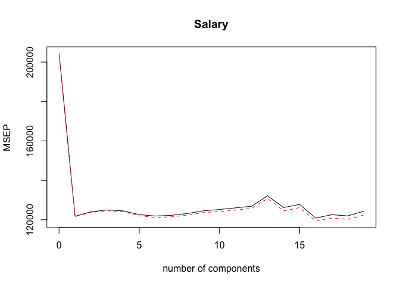
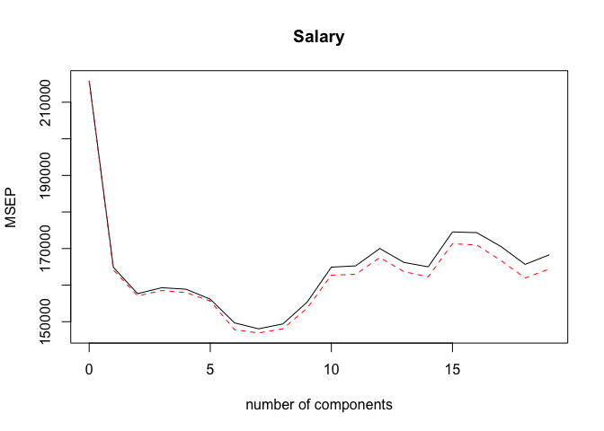
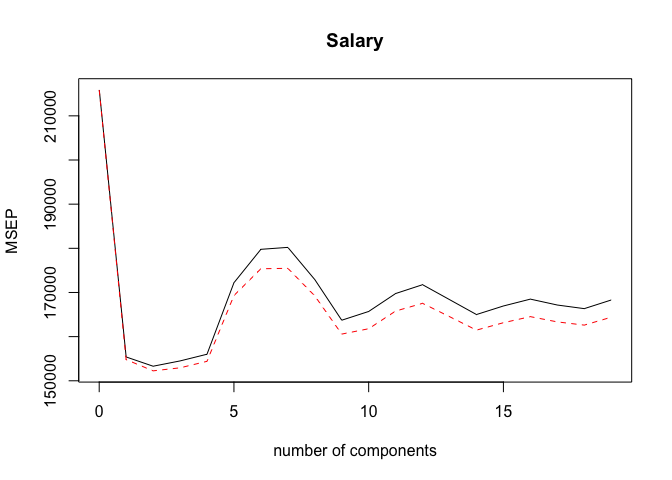
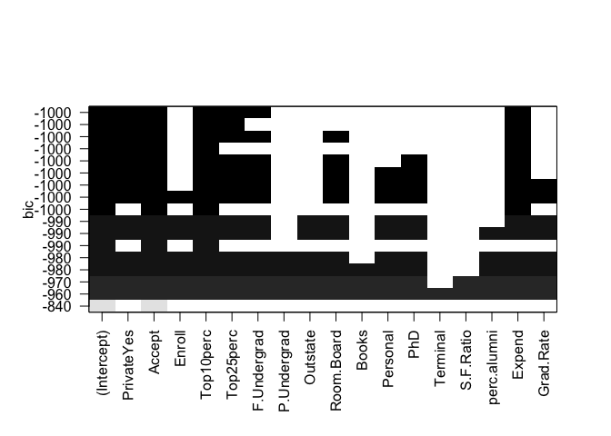
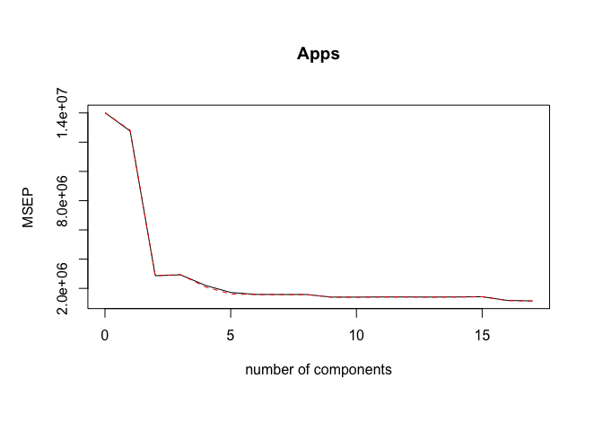
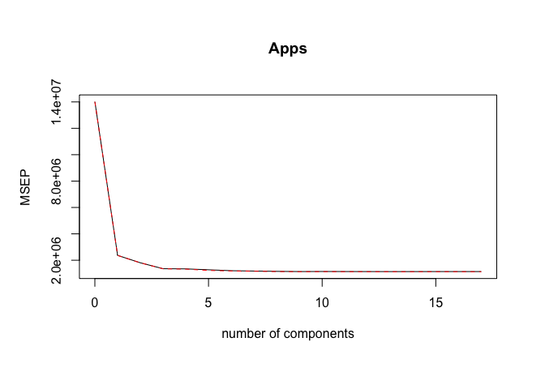

# Chapter 6 Lab 3: PCR and PLS Regression
# Principal Components Regression

```r
#Again, ensure that the missing values have been removed from the data, as described in Section 6.5.
dim(Hitters)
```

```
## [1] 322  20
```

```r
sum(is.na(Hitters$Salary))
```

```
## [1] 59
```

```r
Hitters=na.omit(Hitters)
dim(Hitters)
```

```
## [1] 263  20
```

```r
sum(is.na(Hitters))
```

```
## [1] 0
```

```r
x=model.matrix(Salary~.,Hitters)[,-1]
y=Hitters$Salary
set.seed(1)
train=sample(1:nrow(x), nrow(x)/2)
test=(-train)
y.test=y[test]

library(pls)
```

```
## 
## Attaching package: 'pls'
```

```
## The following object is masked from 'package:stats':
## 
##     loadings
```

```r
set.seed(2)
pcr.fit=pcr(Salary~., data=Hitters,scale=TRUE,validation="CV")
# The syntax for the pcr() function is similar to that for lm(), with a few additional options. Setting scale=TRUE has the effect of standardizing each predictor, using (6.6), prior to generating the principal components, so that the scale on which each variable is measured will not have an effect. Setting validation="CV" causes pcr() to compute the ten-fold cross-validation error for each possible value of M , the number of principal components used. The resulting fit can be examined using summary().
summary(pcr.fit)
```

```
## Data: 	X dimension: 263 19 
## 	Y dimension: 263 1
## Fit method: svdpc
## Number of components considered: 19
## 
## VALIDATION: RMSEP
## Cross-validated using 10 random segments.
##        (Intercept)  1 comps  2 comps  3 comps  4 comps  5 comps  6 comps
## CV             452    348.9    352.2    353.5    352.8    350.1    349.1
## adjCV          452    348.7    351.8    352.9    352.1    349.3    348.0
##        7 comps  8 comps  9 comps  10 comps  11 comps  12 comps  13 comps
## CV       349.6    350.9    352.9     353.8     355.0     356.2     363.5
## adjCV    348.5    349.8    351.6     352.3     353.4     354.5     361.6
##        14 comps  15 comps  16 comps  17 comps  18 comps  19 comps
## CV        355.2     357.4     347.6     350.1     349.2     352.6
## adjCV     352.8     355.2     345.5     347.6     346.7     349.8
## 
## TRAINING: % variance explained
##         1 comps  2 comps  3 comps  4 comps  5 comps  6 comps  7 comps
## X         38.31    60.16    70.84    79.03    84.29    88.63    92.26
## Salary    40.63    41.58    42.17    43.22    44.90    46.48    46.69
##         8 comps  9 comps  10 comps  11 comps  12 comps  13 comps  14 comps
## X         94.96    96.28     97.26     97.98     98.65     99.15     99.47
## Salary    46.75    46.86     47.76     47.82     47.85     48.10     50.40
##         15 comps  16 comps  17 comps  18 comps  19 comps
## X          99.75     99.89     99.97     99.99    100.00
## Salary     50.55     53.01     53.85     54.61     54.61
```

```r
# The CV score is provided for each possible number of components, ranging from M = 0 onwards. (We have printed the CV output only up to M = 4.) Note that pcr() reports the root mean squared error; in order to obtain the usual MSE, we must square this quantity. For instance, a root mean squared error of 352.8 corresponds to an MSE of 352.82 = 124,468.
# One can also plot the cross-validation scores using the validationplot() validation function. Using val.type="MSEP" will cause the cross-validation MSE to be plot() plotted.
validationplot(pcr.fit,val.type="MSEP")
```

<!-- -->

```r
# We see that the smallest cross-validation error occurs when M = 16 com- ponents are used. This is barely fewer than M = 19, which amounts to simply performing least squares, because when all of the components are used in PCR no dimension reduction occurs. However, from the plot we also see that the cross-validation error is roughly the same when only one component is included in the model. This suggests that a model that uses just a small number of components might suffice.
# The summary() function also provides the percentage of variance explained in the predictors and in the response using different numbers of compo- nents. This concept is discussed in greater detail in Chapter 10. Briefly, we can think of this as the amount of information about the predictors or the response that is captured using M principal components. For example, setting M = 1 only captures 38.31 % of all the variance, or information, in the predictors. In contrast, using M = 6 increases the value to 88.63 %. If we were to use all M = p = 19 components, this would increase to 100 %.
# We now perform PCR on the training data and evaluate its test set performance.
set.seed(1)
pcr.fit=pcr(Salary~., data=Hitters,subset=train,scale=TRUE, validation="CV")
validationplot(pcr.fit,val.type="MSEP")
```

<!-- -->

```r
# Now we find that the lowest cross-validation error occurs when M = 7 component are used. We compute the test MSE as follows.
pcr.pred=predict(pcr.fit,x[test,],ncomp=7)
mean((pcr.pred-y.test)^2)
```

```
## [1] 96556.22
```

```r
# This test set MSE is competitive with the results obtained using ridge re- gression and the lasso. However, as a result of the way PCR is implemented, the final model is more difficult to interpret because it does not perform any kind of variable selection or even directly produce coefficient estimates.
# Finally, we fit PCR on the full data set, using M = 7, the number of components identified by cross-validation.
pcr.fit=pcr(y~x,scale=TRUE,ncomp=7)
summary(pcr.fit)
```

```
## Data: 	X dimension: 263 19 
## 	Y dimension: 263 1
## Fit method: svdpc
## Number of components considered: 7
## TRAINING: % variance explained
##    1 comps  2 comps  3 comps  4 comps  5 comps  6 comps  7 comps
## X    38.31    60.16    70.84    79.03    84.29    88.63    92.26
## y    40.63    41.58    42.17    43.22    44.90    46.48    46.69
```
# 6.7.2 Partial Least Squares

```r
# We implement partial least squares (PLS) using the plsr() function, also plsr() in the pls library. The syntax is just like that of the pcr() function
set.seed(1)
pls.fit=plsr(Salary~., data=Hitters,subset=train,scale=TRUE, validation="CV")
summary(pls.fit)
```

```
## Data: 	X dimension: 131 19 
## 	Y dimension: 131 1
## Fit method: kernelpls
## Number of components considered: 19
## 
## VALIDATION: RMSEP
## Cross-validated using 10 random segments.
##        (Intercept)  1 comps  2 comps  3 comps  4 comps  5 comps  6 comps
## CV           464.6    394.2    391.5    393.1    395.0    415.0    424.0
## adjCV        464.6    393.4    390.2    391.1    392.9    411.5    418.8
##        7 comps  8 comps  9 comps  10 comps  11 comps  12 comps  13 comps
## CV       424.5    415.8    404.6     407.1     412.0     414.4     410.3
## adjCV    418.9    411.4    400.7     402.2     407.2     409.3     405.6
##        14 comps  15 comps  16 comps  17 comps  18 comps  19 comps
## CV        406.2     408.6     410.5     408.8     407.8     410.2
## adjCV     401.8     403.9     405.6     404.1     403.2     405.5
## 
## TRAINING: % variance explained
##         1 comps  2 comps  3 comps  4 comps  5 comps  6 comps  7 comps
## X         38.12    53.46    66.05    74.49    79.33    84.56    87.09
## Salary    33.58    38.96    41.57    42.43    44.04    45.59    47.05
##         8 comps  9 comps  10 comps  11 comps  12 comps  13 comps  14 comps
## X         90.74    92.55     93.94     97.23     97.88     98.35     98.85
## Salary    47.53    48.42     49.68     50.04     50.54     50.78     50.92
##         15 comps  16 comps  17 comps  18 comps  19 comps
## X          99.11     99.43     99.78     99.99    100.00
## Salary     51.04     51.11     51.15     51.16     51.18
```

```r
validationplot(pls.fit,val.type="MSEP")
```

<!-- -->

```r
# The lowest cross-validation error occurs when only M = 2 partial least squares directions are used. We now evaluate the corresponding test set MSE.
pls.pred=predict(pls.fit,x[test,],ncomp=2)
mean((pls.pred-y.test)^2)
```

```
## [1] 101417.5
```

```r
# The test MSE is comparable to, but slightly higher than, the test MSE obtained using ridge regression, the lasso, and PCR. Finally, we perform PLS using the full data set, using M = 2, the number of components identified by cross-validation.
pls.fit=plsr(Salary~., data=Hitters,scale=TRUE,ncomp=2)
summary(pls.fit)
```

```
## Data: 	X dimension: 263 19 
## 	Y dimension: 263 1
## Fit method: kernelpls
## Number of components considered: 2
## TRAINING: % variance explained
##         1 comps  2 comps
## X         38.08    51.03
## Salary    43.05    46.40
```
# practice

```r
#9 e, f, g
# 9 In this exercise, we will predict the number of applications received using the other variables in the College data set.
# (a) Split the data set into a training set and a test set.
set.seed(1)
summary(College)
```

```
##  Private        Apps           Accept          Enroll       Top10perc    
##  No :212   Min.   :   81   Min.   :   72   Min.   :  35   Min.   : 1.00  
##  Yes:565   1st Qu.:  776   1st Qu.:  604   1st Qu.: 242   1st Qu.:15.00  
##            Median : 1558   Median : 1110   Median : 434   Median :23.00  
##            Mean   : 3002   Mean   : 2019   Mean   : 780   Mean   :27.56  
##            3rd Qu.: 3624   3rd Qu.: 2424   3rd Qu.: 902   3rd Qu.:35.00  
##            Max.   :48094   Max.   :26330   Max.   :6392   Max.   :96.00  
##    Top25perc      F.Undergrad     P.Undergrad         Outstate    
##  Min.   :  9.0   Min.   :  139   Min.   :    1.0   Min.   : 2340  
##  1st Qu.: 41.0   1st Qu.:  992   1st Qu.:   95.0   1st Qu.: 7320  
##  Median : 54.0   Median : 1707   Median :  353.0   Median : 9990  
##  Mean   : 55.8   Mean   : 3700   Mean   :  855.3   Mean   :10441  
##  3rd Qu.: 69.0   3rd Qu.: 4005   3rd Qu.:  967.0   3rd Qu.:12925  
##  Max.   :100.0   Max.   :31643   Max.   :21836.0   Max.   :21700  
##    Room.Board       Books           Personal         PhD        
##  Min.   :1780   Min.   :  96.0   Min.   : 250   Min.   :  8.00  
##  1st Qu.:3597   1st Qu.: 470.0   1st Qu.: 850   1st Qu.: 62.00  
##  Median :4200   Median : 500.0   Median :1200   Median : 75.00  
##  Mean   :4358   Mean   : 549.4   Mean   :1341   Mean   : 72.66  
##  3rd Qu.:5050   3rd Qu.: 600.0   3rd Qu.:1700   3rd Qu.: 85.00  
##  Max.   :8124   Max.   :2340.0   Max.   :6800   Max.   :103.00  
##     Terminal       S.F.Ratio      perc.alumni        Expend     
##  Min.   : 24.0   Min.   : 2.50   Min.   : 0.00   Min.   : 3186  
##  1st Qu.: 71.0   1st Qu.:11.50   1st Qu.:13.00   1st Qu.: 6751  
##  Median : 82.0   Median :13.60   Median :21.00   Median : 8377  
##  Mean   : 79.7   Mean   :14.09   Mean   :22.74   Mean   : 9660  
##  3rd Qu.: 92.0   3rd Qu.:16.50   3rd Qu.:31.00   3rd Qu.:10830  
##  Max.   :100.0   Max.   :39.80   Max.   :64.00   Max.   :56233  
##    Grad.Rate     
##  Min.   : 10.00  
##  1st Qu.: 53.00  
##  Median : 65.00  
##  Mean   : 65.46  
##  3rd Qu.: 78.00  
##  Max.   :118.00
```

```r
#x=model.matrix(Apps~.,College)[,-1] # Remove the first column, (Intercept)
x=model.matrix(Apps~.,College) # Does not remove the first column, (Intercept)
y=College$Apps
dim(x) # 777 17
```

```
## [1] 777  18
```

```r
set.seed(1)
train=sample(c(TRUE,FALSE), nrow(College),rep=TRUE)
test=(!train)
# train=sample(1:nrow(x), nrow(x)/2) # divide into two. glmnet vignet way
# test=(-train) # interesting way found in glmet vignet?
x.test=x[test,]
# x.train=x[train,]
y.test=y[test]
# y.train=y[train]
# (b) Fit a linear model using least squares on the training set, and report the test error obtained.
colnames(College)
```

```
##  [1] "Private"     "Apps"        "Accept"      "Enroll"      "Top10perc"  
##  [6] "Top25perc"   "F.Undergrad" "P.Undergrad" "Outstate"    "Room.Board" 
## [11] "Books"       "Personal"    "PhD"         "Terminal"    "S.F.Ratio"  
## [16] "perc.alumni" "Expend"      "Grad.Rate"
```

```r
sum(is.na(College)) # no NA
```

```
## [1] 0
```

```r
# use regsubsets()
regfit.best<-regsubsets(Apps~.,data=College[train,],nvmax=17)
summary(regfit.best)
```

```
## Subset selection object
## Call: regsubsets.formula(Apps ~ ., data = College[train, ], nvmax = 17)
## 17 Variables  (and intercept)
##             Forced in Forced out
## PrivateYes      FALSE      FALSE
## Accept          FALSE      FALSE
## Enroll          FALSE      FALSE
## Top10perc       FALSE      FALSE
## Top25perc       FALSE      FALSE
## F.Undergrad     FALSE      FALSE
## P.Undergrad     FALSE      FALSE
## Outstate        FALSE      FALSE
## Room.Board      FALSE      FALSE
## Books           FALSE      FALSE
## Personal        FALSE      FALSE
## PhD             FALSE      FALSE
## Terminal        FALSE      FALSE
## S.F.Ratio       FALSE      FALSE
## perc.alumni     FALSE      FALSE
## Expend          FALSE      FALSE
## Grad.Rate       FALSE      FALSE
## 1 subsets of each size up to 17
## Selection Algorithm: exhaustive
##           PrivateYes Accept Enroll Top10perc Top25perc F.Undergrad
## 1  ( 1 )  " "        "*"    " "    " "       " "       " "        
## 2  ( 1 )  " "        "*"    " "    "*"       " "       " "        
## 3  ( 1 )  " "        "*"    " "    "*"       " "       " "        
## 4  ( 1 )  "*"        "*"    " "    "*"       " "       " "        
## 5  ( 1 )  "*"        "*"    " "    "*"       "*"       " "        
## 6  ( 1 )  "*"        "*"    " "    "*"       "*"       "*"        
## 7  ( 1 )  "*"        "*"    " "    "*"       "*"       "*"        
## 8  ( 1 )  "*"        "*"    " "    "*"       "*"       "*"        
## 9  ( 1 )  "*"        "*"    " "    "*"       "*"       "*"        
## 10  ( 1 ) "*"        "*"    " "    "*"       "*"       "*"        
## 11  ( 1 ) "*"        "*"    "*"    "*"       "*"       "*"        
## 12  ( 1 ) "*"        "*"    "*"    "*"       "*"       "*"        
## 13  ( 1 ) "*"        "*"    "*"    "*"       "*"       "*"        
## 14  ( 1 ) "*"        "*"    "*"    "*"       "*"       "*"        
## 15  ( 1 ) "*"        "*"    "*"    "*"       "*"       "*"        
## 16  ( 1 ) "*"        "*"    "*"    "*"       "*"       "*"        
## 17  ( 1 ) "*"        "*"    "*"    "*"       "*"       "*"        
##           P.Undergrad Outstate Room.Board Books Personal PhD Terminal
## 1  ( 1 )  " "         " "      " "        " "   " "      " " " "     
## 2  ( 1 )  " "         " "      " "        " "   " "      " " " "     
## 3  ( 1 )  " "         " "      " "        " "   " "      " " " "     
## 4  ( 1 )  " "         " "      " "        " "   " "      " " " "     
## 5  ( 1 )  " "         " "      " "        " "   " "      " " " "     
## 6  ( 1 )  " "         " "      " "        " "   " "      " " " "     
## 7  ( 1 )  " "         " "      "*"        " "   " "      " " " "     
## 8  ( 1 )  " "         " "      "*"        " "   " "      "*" " "     
## 9  ( 1 )  " "         " "      "*"        " "   "*"      "*" " "     
## 10  ( 1 ) " "         " "      "*"        " "   "*"      "*" " "     
## 11  ( 1 ) " "         " "      "*"        " "   "*"      "*" " "     
## 12  ( 1 ) " "         "*"      "*"        " "   "*"      "*" " "     
## 13  ( 1 ) " "         "*"      "*"        " "   "*"      "*" " "     
## 14  ( 1 ) "*"         "*"      "*"        " "   "*"      "*" " "     
## 15  ( 1 ) "*"         "*"      "*"        "*"   "*"      "*" " "     
## 16  ( 1 ) "*"         "*"      "*"        "*"   "*"      "*" " "     
## 17  ( 1 ) "*"         "*"      "*"        "*"   "*"      "*" "*"     
##           S.F.Ratio perc.alumni Expend Grad.Rate
## 1  ( 1 )  " "       " "         " "    " "      
## 2  ( 1 )  " "       " "         " "    " "      
## 3  ( 1 )  " "       " "         "*"    " "      
## 4  ( 1 )  " "       " "         "*"    " "      
## 5  ( 1 )  " "       " "         "*"    " "      
## 6  ( 1 )  " "       " "         "*"    " "      
## 7  ( 1 )  " "       " "         "*"    " "      
## 8  ( 1 )  " "       " "         "*"    " "      
## 9  ( 1 )  " "       " "         "*"    " "      
## 10  ( 1 ) " "       " "         "*"    "*"      
## 11  ( 1 ) " "       " "         "*"    "*"      
## 12  ( 1 ) " "       " "         "*"    "*"      
## 13  ( 1 ) " "       "*"         "*"    "*"      
## 14  ( 1 ) " "       "*"         "*"    "*"      
## 15  ( 1 ) " "       "*"         "*"    "*"      
## 16  ( 1 ) "*"       "*"         "*"    "*"      
## 17  ( 1 ) "*"       "*"         "*"    "*"
```

```r
plot(regfit.best)
#
val.errors=rep(NA,17)
for(i in 1:17){
   coefi=coef(regfit.best,id=i)
   pred=x.test[,names(coefi)]%*%coefi
   val.errors[i]=mean((College$Apps[test]-pred)^2)
}
val.errors
```

```
##  [1] 1714544 1542316 1510924 1512552 1492114 1635683 1645549 1610020
##  [9] 1626584 1616854 1555953 1520681 1526317 1519996 1522719 1520481
## [17] 1520331
```

```r
which.min(val.errors) # 5
```

```
## [1] 5
```

```r
# MSE. There is no predict function for this
#mean((predict(summary(rigfit.full),newx=x.test)-y.test)^2)
coef(regfit.best,5)
```

```
##   (Intercept)    PrivateYes        Accept     Top10perc     Top25perc 
## -114.81292106 -617.07313758    1.28203523   50.65442163  -16.79622599 
##        Expend 
##    0.05489076
```

```r
# from text book
predict.regsubsets=function(object,newdata,id,...){
  form=as.formula(object$call[[2]])
  mat=model.matrix(form,newdata)
  coefi=coef(object,id=id)
  xvars=names(coefi)
  mat[,xvars]%*%coefi
}
as.formula(regfit.best$call[[2]])
```

```
## Apps ~ .
```

```r
coef(regfit.best,id=5)
```

```
##   (Intercept)    PrivateYes        Accept     Top10perc     Top25perc 
## -114.81292106 -617.07313758    1.28203523   50.65442163  -16.79622599 
##        Expend 
##    0.05489076
```

```r
predict.regsubsets.test<-predict.regsubsets(regfit.best,newdata=College[test,],id=5)
length(predict.regsubsets.test) # 377
```

```
## [1] 377
```

```r
# back to lm
lm.train<-lm(Apps~., data=College,subset=train)
summary(lm.train)
```

```
## 
## Call:
## lm(formula = Apps ~ ., data = College, subset = train)
## 
## Residuals:
##     Min      1Q  Median      3Q     Max 
## -2485.0  -392.4   -57.9   261.6  6637.3 
## 
## Coefficients:
##               Estimate Std. Error t value Pr(>|t|)    
## (Intercept) -756.88732  535.44217  -1.414 0.158301    
## PrivateYes  -515.36459  190.44202  -2.706 0.007112 ** 
## Accept         1.20916    0.07046  17.161  < 2e-16 ***
## Enroll        -0.29026    0.23380  -1.241 0.215188    
## Top10perc     52.53768    7.69358   6.829 3.38e-11 ***
## Top25perc    -16.38973    6.09706  -2.688 0.007500 ** 
## F.Undergrad    0.09625    0.04103   2.346 0.019495 *  
## P.Undergrad    0.02831    0.05417   0.523 0.601540    
## Outstate      -0.02161    0.02599  -0.831 0.406262    
## Room.Board     0.13204    0.06968   1.895 0.058847 .  
## Books          0.16642    0.34092   0.488 0.625726    
## Personal       0.16409    0.09270   1.770 0.077519 .  
## PhD           -8.51810    6.73921  -1.264 0.207015    
## Terminal      -0.35379    7.43056  -0.048 0.962049    
## S.F.Ratio      3.79436   16.20785   0.234 0.815028    
## perc.alumni   -2.86286    5.56666  -0.514 0.607349    
## Expend         0.05855    0.01528   3.832 0.000148 ***
## Grad.Rate      7.14929    3.91090   1.828 0.068323 .  
## ---
## Signif. codes:  0 '***' 0.001 '**' 0.01 '*' 0.05 '.' 0.1 ' ' 1
## 
## Residual standard error: 1001 on 382 degrees of freedom
## Multiple R-squared:  0.9314,	Adjusted R-squared:  0.9283 
## F-statistic: 304.9 on 17 and 382 DF,  p-value: < 2.2e-16
```

```r
pred.lm<-predict(lm.train,newdata=College[test,-2]) # does work?
length(pred.lm) # 400
```

```
## [1] 377
```

```r
dim(College[test,])
```

```
## [1] 377  18
```

```r
# library(reshape2)
# melt.data<-melt(cbind(data.frame(pred.lm=pred.lm,pred.regsubsets=predict.regsubsets.test),Apps=College[test,2]),id="Apps")
# str(melt.data)
# library(ggplot2)
# ggplot(melt.data,aes(x=Apps,y=value,colour=variable,alpha=0.1)) + geom_point()
# MSE 
mean((pred.lm - College[test,"Apps"])^2) # 1520331 for lm
```

```
## [1] 1520331
```

```r
mean((predict.regsubsets.test - College[test,"Apps"])^2) # 1492114 for regsubsets
```

```
## [1] 1492114
```

```r
# (c) Fit a ridge regression model on the training set, with λ chosen by cross-validation. Report the test error obtained
library(glmnet)
```

```
## Loading required package: Matrix
```

```
## Loading required package: foreach
```

```
## Loaded glmnet 2.0-13
```

<!-- -->

```r
#ridge.mod=glmnet(x,y,alpha=0,lambda=grid) # If alpha=0 then a ridge regression model is fit, and if alpha=1 then a lasso model is fit. 
# Recall from Chapter 3 that the least squares fitting procedure estimates β0,β1,...,βp using the values that minimize: RSS (residual sum of squares, Fig3.1, p62)
ridge.ex9=glmnet(College[train,-2],College[train,"Apps"],alpha=0) # error
```

```
## Error in elnet(x, is.sparse, ix, jx, y, weights, offset, type.gaussian, : (list) object cannot be coerced to type 'double'
```

```r
ridge.ex9=glmnet(x[train,-1],College[train,"Apps"],alpha=0) # removing intercept in x
cv.ridge.ex9<-cv.glmnet(x[train,-1],College[train,"Apps"],alpha=0)
predict(cv.ridge.ex9,s=cv.ridge.ex9$lambda.min,exact=T,type="coefficients")[1:18,] # coefficients
```

```
##   (Intercept)    PrivateYes        Accept        Enroll     Top10perc 
## -1.664996e+03 -5.297808e+02  6.813764e-01  7.234276e-01  2.863680e+01 
##     Top25perc   F.Undergrad   P.Undergrad      Outstate    Room.Board 
##  1.200423e-01  1.393404e-01  1.761140e-02  1.582575e-02  1.799726e-01 
##         Books      Personal           PhD      Terminal     S.F.Ratio 
##  2.814644e-01  8.715456e-02 -2.792170e+00 -2.505627e+00  3.181125e-01 
##   perc.alumni        Expend     Grad.Rate 
## -9.606178e+00  6.615508e-02  8.986881e+00
```

```r
ridge.predict.ex9<-predict(cv.ridge.ex9,s=cv.ridge.ex9$lambda.min,newx=x[test,-1])
# MSE
mean((ridge.predict.ex9 - College[test,"Apps"])^2) # 2585067
```

```
## [1] 2585067
```

```r
# (d) Fit a lasso model on the training set, with λ chosen by cross- validation. Report the test error obtained, along with the number of non-zero coefficient estimates.
lasso.ex9=glmnet(x[train,-1],College[train,"Apps"],alpha=1) # removing intercept in x
cv.lasso.ex9<-cv.glmnet(x[train,-1],College[train,"Apps"],alpha=1)
lasso.ex9.coef<-predict(cv.lasso.ex9,s=cv.lasso.ex9$lambda.min,exact=T,type="coefficients")[1:18,] # coefficients
lasso.ex9.coef[!lasso.ex9.coef==0] #non zero
```

```
##   (Intercept)    PrivateYes        Accept     Top10perc     Top25perc 
## -8.799363e+02 -4.896148e+02  1.149003e+00  4.239582e+01 -8.445945e+00 
##   F.Undergrad   P.Undergrad      Outstate    Room.Board         Books 
##  6.966387e-02  2.046204e-02 -1.612278e-03  1.011751e-01  1.101042e-01 
##      Personal           PhD   perc.alumni        Expend     Grad.Rate 
##  1.428072e-01 -6.834184e+00 -3.502265e+00  5.578810e-02  5.123789e+00
```

```r
lasso.ex9.coef[lasso.ex9.coef!=0] #non zero. this is also OK.
```

```
##   (Intercept)    PrivateYes        Accept     Top10perc     Top25perc 
## -8.799363e+02 -4.896148e+02  1.149003e+00  4.239582e+01 -8.445945e+00 
##   F.Undergrad   P.Undergrad      Outstate    Room.Board         Books 
##  6.966387e-02  2.046204e-02 -1.612278e-03  1.011751e-01  1.101042e-01 
##      Personal           PhD   perc.alumni        Expend     Grad.Rate 
##  1.428072e-01 -6.834184e+00 -3.502265e+00  5.578810e-02  5.123789e+00
```

```r
lasso.predict.ex9<-predict(cv.lasso.ex9,s=cv.ridge.ex9$lambda.min,newx=x[test,-1])
# MSE
mean((lasso.predict.ex9 - College[test,"Apps"])^2) # 2010635. smaller than ridge
```

```
## [1] 2010635
```

```r
## starting from this
# (e) Fit a PCR model on the training set, with M chosen by cross- validation. Report the test error obtained, along with the value of M selected by cross-validation.
library(pls)
set.seed(2)
pcr.fit=pcr(Apps~., data=College,subset=train,scale=TRUE,validation="CV")
validationplot(pcr.fit,val.type="MSEP") # which M? 5?
```

<!-- -->

```r
# Compute the test MSE.
summary(pcr.fit)
```

```
## Data: 	X dimension: 400 17 
## 	Y dimension: 400 1
## Fit method: svdpc
## Number of components considered: 17
## 
## VALIDATION: RMSEP
## Cross-validated using 10 random segments.
##        (Intercept)  1 comps  2 comps  3 comps  4 comps  5 comps  6 comps
## CV            3744     3572     1693     1712     1483     1312     1260
## adjCV         3744     3579     1691     1716     1447     1270     1256
##        7 comps  8 comps  9 comps  10 comps  11 comps  12 comps  13 comps
## CV        1257     1258     1185      1184      1189      1188      1186
## adjCV     1255     1256     1181      1181      1186      1185      1183
##        14 comps  15 comps  16 comps  17 comps
## CV         1189      1196      1085      1069
## adjCV      1186      1193      1080      1064
## 
## TRAINING: % variance explained
##       1 comps  2 comps  3 comps  4 comps  5 comps  6 comps  7 comps
## X       32.07    58.34    64.91    70.53    75.95    81.04    84.82
## Apps    11.14    80.28    80.29    86.40    89.31    89.41    89.47
##       8 comps  9 comps  10 comps  11 comps  12 comps  13 comps  14 comps
## X       88.19    91.14     93.51     95.61     97.27     98.31     99.01
## Apps    89.57    90.68     90.77     90.78     90.82     90.88     90.89
##       15 comps  16 comps  17 comps
## X        99.48     99.81    100.00
## Apps     90.93     92.63     93.14
```

```r
pcr.pred=predict(pcr.fit,newdata=x[test,][,-1],ncomp=5)
mean((pcr.pred-y.test)^2) # 3519875, which is larger than lasso
```

```
## [1] 3519875
```

```r
# (f) Fit a PLS model on the training set, with M chosen by cross- validation. Report the test error obtained, along with the value of M selected by cross-validation.
set.seed(1)
pls.fit=plsr(Apps~., data=College,subset=train,scale=TRUE, validation="CV")
summary(pls.fit)
```

```
## Data: 	X dimension: 400 17 
## 	Y dimension: 400 1
## Fit method: kernelpls
## Number of components considered: 17
## 
## VALIDATION: RMSEP
## Cross-validated using 10 random segments.
##        (Intercept)  1 comps  2 comps  3 comps  4 comps  5 comps  6 comps
## CV            3744     1539     1344     1165     1160     1130     1098
## adjCV         3744     1538     1344     1163     1152     1107     1090
##        7 comps  8 comps  9 comps  10 comps  11 comps  12 comps  13 comps
## CV        1086     1076     1068      1071      1069      1068      1067
## adjCV     1079     1070     1064      1066      1064      1064      1063
##        14 comps  15 comps  16 comps  17 comps
## CV         1068      1069      1068      1068
## adjCV      1063      1064      1064      1064
## 
## TRAINING: % variance explained
##       1 comps  2 comps  3 comps  4 comps  5 comps  6 comps  7 comps
## X       27.28    50.45    63.72    66.60    68.38    72.56    75.63
## Apps    83.57    87.63    90.98    91.71    92.72    92.99    93.06
##       8 comps  9 comps  10 comps  11 comps  12 comps  13 comps  14 comps
## X       79.99    83.33     85.84     88.70     91.51     93.71     96.30
## Apps    93.09    93.11     93.12     93.13     93.13     93.14     93.14
##       15 comps  16 comps  17 comps
## X        97.40     99.20    100.00
## Apps     93.14     93.14     93.14
```

```r
validationplot(pls.fit,val.type="MSEP")
```

<!-- -->

```r
# The lowest cross-validation error occurs when only M = 2 partial least squares directions are used. We now evaluate the corresponding test set MSE.
pls.pred=predict(pls.fit,x[test,][,-1],ncomp=3)
mean((pls.pred-y.test)^2) # 2982036
```

```
## [1] 2982036
```

```r
# (g) Comment on the results obtained. How accurately can we pre- dict the number of college applications received? Is there much difference among the test errors resulting from these five approaches?
## lm is the best?!
mean((pred.lm - College[test,"Apps"])^2) # 1520331 for lm
```

```
## [1] 1520331
```

```r
mean((ridge.predict.ex9 - College[test,"Apps"])^2) # 2585067
```

```
## [1] 2585067
```

```r
mean((lasso.predict.ex9 - College[test,"Apps"])^2) # 2010635. smaller than ridge
```

```
## [1] 2010635
```

```r
mean((pcr.pred-y.test)^2) # 3519875, which is larger than lasso
```

```
## [1] 3519875
```

```r
mean((pls.pred-y.test)^2) # 2982036
```

```
## [1] 2982036
```
#11 a,b,c, for all, we already did this, update for PCR

