# Chapter 6 Lab 2: Ridge Regression and the Lasso

```r
dim(Hitters)
```

```
## [1] 322  20
```

```r
sum(is.na(Hitters$Salary))
```

```
## [1] 59
```

```r
Hitters=na.omit(Hitters)
dim(Hitters)
```

```
## [1] 263  20
```

```r
sum(is.na(Hitters))
```

```
## [1] 0
```

```r
x=model.matrix(Salary~.,Hitters)[,-1]
y=Hitters$Salary
# note: "The model.matrix() function is particularly useful for creating x; not only does it produce a matrix corresponding to the 19 predictors but it also automatically transforms any qualitative variables into dummy variables. The latter property is important because glmnet() can only take numerical, quantitative inputs."
# Ridge Regression
library(glmnet)
```

```
## Loading required package: Matrix
```

```
## Loading required package: foreach
```

```
## Loaded glmnet 2.0-13
```

```r
grid=10^seq(10,-2,length=100)
ridge.mod=glmnet(x,y,alpha=0,lambda=grid)
dim(coef(ridge.mod))
```

```
## [1]  20 100
```

```r
ridge.mod$lambda[50]
```

```
## [1] 11497.57
```

```r
coef(ridge.mod)[,50]
```

```
##   (Intercept)         AtBat          Hits         HmRun          Runs 
## 407.356050200   0.036957182   0.138180344   0.524629976   0.230701523 
##           RBI         Walks         Years        CAtBat         CHits 
##   0.239841459   0.289618741   1.107702929   0.003131815   0.011653637 
##        CHmRun         CRuns          CRBI        CWalks       LeagueN 
##   0.087545670   0.023379882   0.024138320   0.025015421   0.085028114 
##     DivisionW       PutOuts       Assists        Errors    NewLeagueN 
##  -6.215440973   0.016482577   0.002612988  -0.020502690   0.301433531
```

```r
sqrt(sum(coef(ridge.mod)[-1,50]^2))
```

```
## [1] 6.360612
```

```r
ridge.mod$lambda[60]
```

```
## [1] 705.4802
```

```r
coef(ridge.mod)[,60]
```

```
##  (Intercept)        AtBat         Hits        HmRun         Runs 
##  54.32519950   0.11211115   0.65622409   1.17980910   0.93769713 
##          RBI        Walks        Years       CAtBat        CHits 
##   0.84718546   1.31987948   2.59640425   0.01083413   0.04674557 
##       CHmRun        CRuns         CRBI       CWalks      LeagueN 
##   0.33777318   0.09355528   0.09780402   0.07189612  13.68370191 
##    DivisionW      PutOuts      Assists       Errors   NewLeagueN 
## -54.65877750   0.11852289   0.01606037  -0.70358655   8.61181213
```

```r
sqrt(sum(coef(ridge.mod)[-1,60]^2))
```

```
## [1] 57.11001
```

```r
predict(ridge.mod,s=50,type="coefficients")[1:20,]
```

```
##   (Intercept)         AtBat          Hits         HmRun          Runs 
##  4.876610e+01 -3.580999e-01  1.969359e+00 -1.278248e+00  1.145892e+00 
##           RBI         Walks         Years        CAtBat         CHits 
##  8.038292e-01  2.716186e+00 -6.218319e+00  5.447837e-03  1.064895e-01 
##        CHmRun         CRuns          CRBI        CWalks       LeagueN 
##  6.244860e-01  2.214985e-01  2.186914e-01 -1.500245e-01  4.592589e+01 
##     DivisionW       PutOuts       Assists        Errors    NewLeagueN 
## -1.182011e+02  2.502322e-01  1.215665e-01 -3.278600e+00 -9.496680e+00
```

```r
set.seed(1)
train=sample(1:nrow(x), nrow(x)/2)
test=(-train)
y.test=y[test]
## Next we fit a ridge regression model on the training set, and evaluate its MSE on the test set, using λ = 4. Note the use of the predict() function again. This time we get predictions for a test set, by replacing type="coefficients" with the newx argument.
ridge.mod=glmnet(x[train,],y[train],alpha=0,lambda=grid, thresh=1e-12)
ridge.pred=predict(ridge.mod,s=4,newx=x[test,])
mean((ridge.pred-y.test)^2) # MSE 101036.8
```

```
## [1] 101036.8
```

```r
## The test MSE is 101037. Note that if we had instead simply fit a model with just an intercept, we would have predicted each test observation using the mean of the training observations. In that case, we could compute the test set MSE like this:
mean((mean(y[train])-y.test)^2) 
```

```
## [1] 193253.1
```

```r
# We could also get the same result by fitting a ridge regression model with a very large value of λ. Note that 1e10 means 1010.
ridge.pred=predict(ridge.mod,s=1e10,newx=x[test,])
mean((ridge.pred-y.test)^2) # 193253.1
```

```
## [1] 193253.1
```

```r
# So fitting a ridge regression model with λ = 4 leads to a much lower test MSE than fitting a model with just an intercept. We now check whether there is any benefit to performing ridge regression with λ = 4 instead of just performing least squares regression. Recall that least squares is simply ridge regression with λ = 0.7
ridge.pred=predict(ridge.mod,s=0,newx=x[test,],exact=T)
```

```
## Error: used coef.glmnet() or predict.glmnet() with `exact=TRUE` so must in addition supply original argument(s)  x and y  in order to safely rerun glmnet
```

```r
mean((ridge.pred-y.test)^2)
```

```
## [1] 193253.1
```

```r
lm(y~x, subset=train)
```

```
## 
## Call:
## lm(formula = y ~ x, subset = train)
## 
## Coefficients:
## (Intercept)       xAtBat        xHits       xHmRun        xRuns  
##   299.42849     -2.54027      8.36682     11.64512     -9.09923  
##        xRBI       xWalks       xYears      xCAtBat       xCHits  
##     2.44105      9.23440    -22.93673     -0.18154     -0.11598  
##     xCHmRun       xCRuns        xCRBI      xCWalks     xLeagueN  
##    -1.33888      3.32838      0.07536     -1.07841     59.76065  
##  xDivisionW     xPutOuts     xAssists      xErrors  xNewLeagueN  
##   -98.86233      0.34087      0.34165     -0.64207     -0.67442
```

```r
predict(ridge.mod,s=0,exact=T,type="coefficients")[1:20,]
```

```
## Error: used coef.glmnet() or predict.glmnet() with `exact=TRUE` so must in addition supply original argument(s)  x and y  in order to safely rerun glmnet
```

```r
# In general, if we want to fit a (unpenalized) least squares model, then we should use the lm() function, since that function provides more useful outputs, such as standard errors and p-values for the coefficients. In general, instead of arbitrarily choosing λ = 4, it would be better to use cross-validation to choose the tuning parameter λ. We can do this using the built-in cross-validation function, cv.glmnet(). By default, the function performs ten-fold cross-validation, though this can be changed using the argument nfolds. Note that we set a random seed first so our results will be reproducible, since the choice of the cross-validation folds is random.
set.seed(1)
cv.out=cv.glmnet(x[train,],y[train],alpha=0)
plot(cv.out)
```

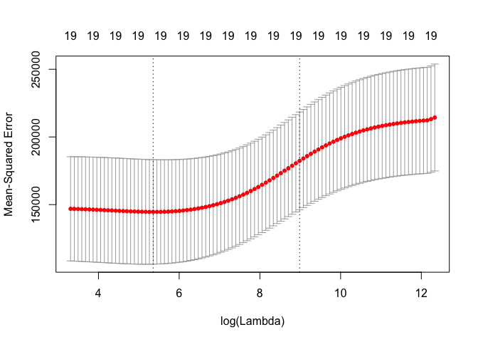<!-- -->

```r
bestlam=cv.out$lambda.min
bestlam # 212
```

```
## [1] 211.7416
```

```r
# Therefore, we see that the value of λ that results in the smallest cross- validation error is 212. What is the test MSE associated with this value of λ?
ridge.pred=predict(ridge.mod,s=bestlam,newx=x[test,])
mean((ridge.pred-y.test)^2)
```

```
## [1] 96015.51
```

```r
# This represents a further improvement over the test MSE that we got using λ = 4. Finally, we refit our ridge regression model on the full data set, using the value of λ chosen by cross-validation, and examine the coefficient estimates.
out=glmnet(x,y,alpha=0)
predict(out,type="coefficients",s=bestlam)[1:20,]
```

```
##  (Intercept)        AtBat         Hits        HmRun         Runs 
##   9.88487157   0.03143991   1.00882875   0.13927624   1.11320781 
##          RBI        Walks        Years       CAtBat        CHits 
##   0.87318990   1.80410229   0.13074381   0.01113978   0.06489843 
##       CHmRun        CRuns         CRBI       CWalks      LeagueN 
##   0.45158546   0.12900049   0.13737712   0.02908572  27.18227535 
##    DivisionW      PutOuts      Assists       Errors   NewLeagueN 
## -91.63411299   0.19149252   0.04254536  -1.81244470   7.21208390
```
# 6.6.2 Lasso

```r
# We saw that ridge regression with a wise choice of λ can outperform least squares as well as the null model on the Hitters data set. We now ask whether the lasso can yield either a more accurate or a more interpretable model than ridge regression. In order to fit a lasso model, we once again use the glmnet() function; however, this time we use the argument alpha=1. Other than that change, we proceed just as we did in fitting a ridge model.
lasso.mod=glmnet(x[train,],y[train],alpha=1,lambda=grid)
plot(lasso.mod)
```

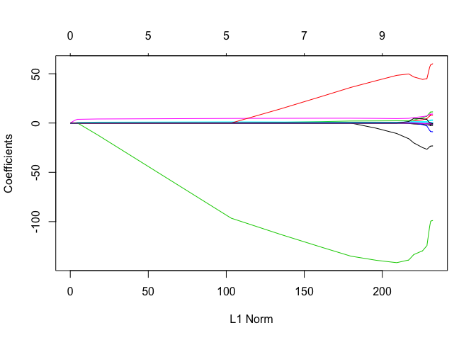<!-- -->

```r
# We can see from the coefficient plot that depending on the choice of tuning parameter, some of the coefficients will be exactly equal to zero. We now perform cross-validation and compute the associated test error.

set.seed(1)
cv.out=cv.glmnet(x[train,],y[train],alpha=1) # 
plot(cv.out)
```

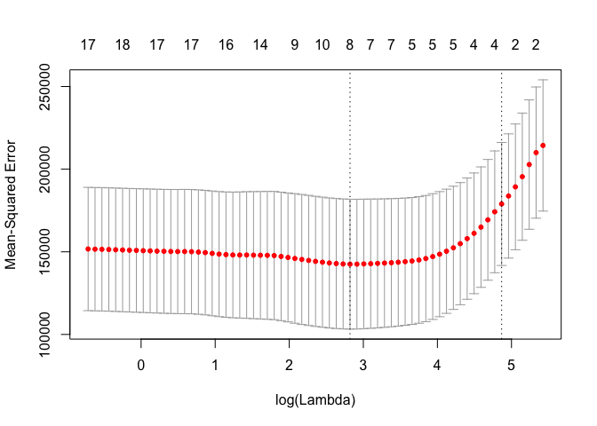<!-- -->

```r
bestlam=cv.out$lambda.min
lasso.pred=predict(lasso.mod,s=bestlam,newx=x[test,])
mean((lasso.pred-y.test)^2) # 100743.4
```

```
## [1] 100743.4
```

```r
# This is substantially lower than the test set MSE of the null model and of least squares, and very similar to the test MSE of ridge regression with λ chosen by cross-validation. However, the lasso has a substantial advantage over ridge regression in that the resulting coefficient estimates are sparse. Here we see that 12 of the 19 coefficient estimates are exactly zero. So the lasso model with λ chosen by cross-validation contains only seven variables.
out=glmnet(x,y,alpha=1,lambda=grid)
lasso.coef=predict(out,type="coefficients",s=bestlam)[1:20,]
lasso.coef
```

```
##  (Intercept)        AtBat         Hits        HmRun         Runs 
##   18.5394844    0.0000000    1.8735390    0.0000000    0.0000000 
##          RBI        Walks        Years       CAtBat        CHits 
##    0.0000000    2.2178444    0.0000000    0.0000000    0.0000000 
##       CHmRun        CRuns         CRBI       CWalks      LeagueN 
##    0.0000000    0.2071252    0.4130132    0.0000000    3.2666677 
##    DivisionW      PutOuts      Assists       Errors   NewLeagueN 
## -103.4845458    0.2204284    0.0000000    0.0000000    0.0000000
```

```r
lasso.coef[lasso.coef!=0]
```

```
##  (Intercept)         Hits        Walks        CRuns         CRBI 
##   18.5394844    1.8735390    2.2178444    0.2071252    0.4130132 
##      LeagueN    DivisionW      PutOuts 
##    3.2666677 -103.4845458    0.2204284
```
# practice

```r
# 2 a, b, (and c if possible)

# 5 c, d (at least for Min Yao)
##  It is well-known that ridge regression tends to give similar coefficient values to correlated variables, whereas the lasso may give quite different coefficient values to correlated variables. We will now explore this property in a very simple setting. Suppose that n = 2, p = 2, x11 = x12, x21 = x22. Furthermore, suppose that y1+y2 =0 and x11+x21 =0 and x12+x22 =0,so that the estimate for the intercept in a least squares, ridge regression, or lasso model is zero: βˆ0 = 0.
## (a) Write out the ridge regression optimization problem in this setting
## (KN) see my notebook.
## (b) Argue that in this setting, the ridge coefficient estimates satisfy βˆ 1 = βˆ 2 .
## (KN) no clear to me
## (c) Write out the lasso optimization problem in this setting.
## (KN) see my notebook. Just replace lamda part
## (d) Argue that in this setting, the lasso coefficients βˆ1 and βˆ2 are not unique—in other words, there are many possible solutions to the optimization problem in (c). Describe these solutions.
## (KN) ?
```

# 8 (you already did this for best subset; update for lasso)

```r
# (a) Use the rnorm() function to generate a predictor X of length n = 100, as well as a noise vector ε of length n = 100.
rm(x,y)
set.seed(1);x<-rnorm(n=100);eps<-rnorm(n=100)
# (b) Generate a response vector Y of length n = 100 according to the model
#b0<-2;b1<-3;b2<- -1;b3<- 0.5 # set1
b0<-5;b1<-6;b2<- 7;b3<- 8 # Geoff's set
y<-b0 + b1 * x + b2 * x^2 +b3*x^3 + eps
# (c) Use the regsubsets() function to perform best subset selection in order to choose the best model containing the predictors X, X2, . . . , X10. What is the best model obtained according to Cp, BIC, and adjusted R2? Show some plots to provide evidence for your answer, and report the coefficients of the best model ob- tained. Note you will need to use the data.frame() function to create a single data set containing both X and Y .
library(leaps)
data<-data.frame(X=x, Y=y)
system.time(regfit.full<-regsubsets(Y~X+I(X^2)+I(X^3)+I(X^4)+I(X^5)+I(X^6)+I(X^7)+I(X^8)+I(X^9)+I(X^10), data=data,nvmax=10))
```

```
##    user  system elapsed 
##   0.005   0.000   0.004
```

```r
reg.full.summary <- summary(regfit.full)
#par(mfrow = c(2, 2)) # preventing errorsin plot
# Cp
plot(reg.full.summary$cp, xlab = "Number of variables", ylab = "C_p", type = "l")
points(which.min(reg.full.summary$cp), reg.full.summary$cp[which.min(reg.full.summary$cp)], col = "red", cex = 2, pch = 20)
```

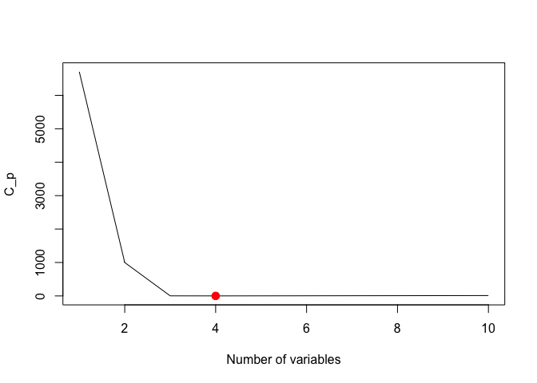<!-- -->

```r
# bic
plot(regfit.full,scale="bic")
```

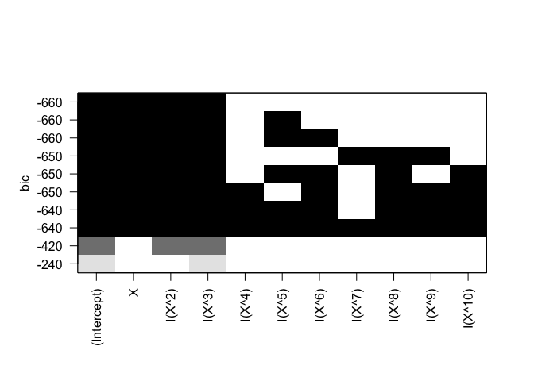<!-- -->

```r
plot(reg.full.summary$bic, xlab = "Number of variables", ylab = "BIC", type = "l")
points(which.min(reg.full.summary$bic), reg.full.summary$bic[which.min(reg.full.summary$bic)], col = "red", cex = 2, pch = 20)
```

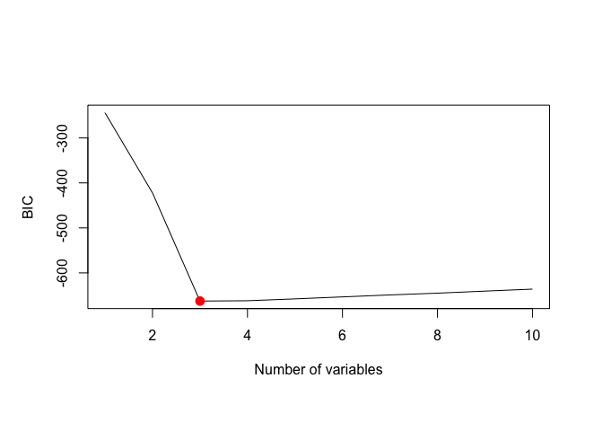<!-- -->

```r
# Adjusted R^2
plot(reg.full.summary$adjr2, xlab = "Number of variables", ylab = "Adjusted R^2", type = "l")
points(which.max(reg.full.summary$adjr2), reg.full.summary$adjr2[which.max(reg.full.summary$adjr2)], col = "red", cex = 2, pch = 20)
```

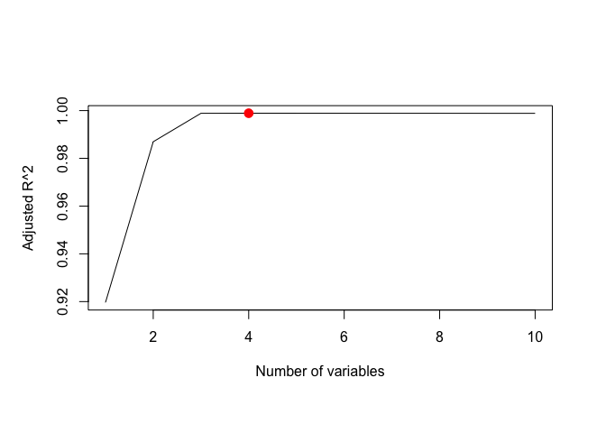<!-- -->

```r
## (d) Repeat (c), using forward stepwise selection and also using back- wards stepwise selection. How does your answer compare to the results in (c)?
regfit.fwd<-regsubsets(Y~X+I(X^2)+I(X^3)+I(X^4)+I(X^5)+I(X^6)+I(X^7)+I(X^8)+I(X^9)+I(X^10), data=data,nvmax=10,method="forward")
# alternative description (learned from Geoff'sscript)
regfit.fwd2 <- regsubsets(y ~ poly(x, 10, raw=T), data = data, nvmax = 10, method = "forward")

regfit.bwd<-regsubsets(Y~X+I(X^2)+I(X^3)+I(X^4)+I(X^5)+I(X^6)+I(X^7)+I(X^8)+I(X^9)+I(X^10), data=data,nvmax=10,method="backward")
coef(regfit.full,7)
```

```
##  (Intercept)            X       I(X^2)       I(X^3)       I(X^5) 
##  5.074706727  6.376680750  6.928139705  7.574377652  0.078062625 
##       I(X^6)       I(X^8)      I(X^10) 
## -0.113745920  0.045641386 -0.004563741
```

```r
coef(regfit.fwd,7)
```

```
##  (Intercept)            X       I(X^2)       I(X^3)       I(X^5) 
##  5.117159301  6.338333111  6.735138516  7.753492110 -0.090459577 
##       I(X^6)       I(X^7)       I(X^9) 
##  0.007273321  0.053554027 -0.005402729
```

```r
coef(regfit.bwd,7)
```

```
##  (Intercept)            X       I(X^2)       I(X^3)       I(X^6) 
##  5.069454108  6.260608424  6.965390872  7.795182201 -0.152111076 
##       I(X^8)       I(X^9)      I(X^10) 
##  0.062803719  0.001608710 -0.006543545
```

```r
# (e) Now fit a lasso model to the simulated data, again using X,X2, . . . , X 10 as predictors. Use cross-validation to select the optimal value of λ. Create plots of the cross-validation error as a function of λ. Report the resulting coefficient estimates, and discuss the results obtained.
library(glmnet)
# lasso.mod=glmnet(x[train,],y[train],alpha=1,lambda=grid) # text way
data.full <- data.frame(y = y, x = x)
xmat <- model.matrix(y ~ x + I(x^2) + I(x^3) + I(x^4) + I(x^5) + I(x^6) + I(x^7) + I(x^8) + I(x^9) + I(x^10), data = data.full)[, -1] # 
# how about 
# xmat2<-model.matrix(y~.,data=data.full) # this is not correct. Geoff's data set itself has x^2, X^3, ...x^10.
system.time(cv.lasso <- cv.glmnet(xmat, y, alpha = 1));plot(cv.lasso)
```

```
##    user  system elapsed 
##   0.079   0.003   0.082
```

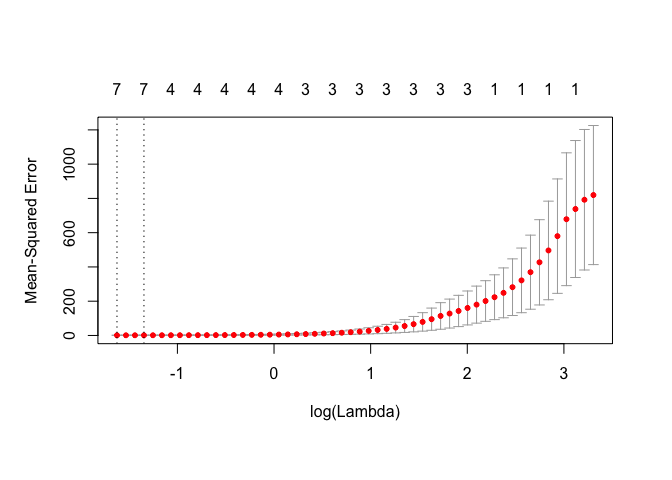<!-- -->

```r
#cv.lasso2 <- cv.glmnet(xmat2, y, alpha = 1);plot(cv.lasso2)
bestlam<-cv.lasso$lambda.min # the best lamda

lasso<-glmnet(xmat,y,alpha=1) # there seems two ways to use glmnet?
# one described in text and another using model.matrix?
# textbook described "grid" method, but glmnet automatically spits out bestlam
predict(lasso, s = bestlam, type = "coefficients")[1:11, ]
```

```
##  (Intercept)            x       I(x^2)       I(x^3)       I(x^4) 
## 5.275718e+00 5.901414e+00 6.512533e+00 7.939618e+00 5.020939e-02 
##       I(x^5)       I(x^6)       I(x^7)       I(x^8)       I(x^9) 
## 3.023436e-04 0.000000e+00 1.035605e-03 0.000000e+00 9.934224e-05 
##      I(x^10) 
## 0.000000e+00
```

```r
predict(cv.lasso, s ="lambda.min", type = "coefficients")[1:11, ] # same! not necessary to get "lasso". use cv.lasso
```

```
##  (Intercept)            x       I(x^2)       I(x^3)       I(x^4) 
## 5.275718e+00 5.901414e+00 6.512533e+00 7.939618e+00 5.020939e-02 
##       I(x^5)       I(x^6)       I(x^7)       I(x^8)       I(x^9) 
## 3.023436e-04 0.000000e+00 1.035605e-03 0.000000e+00 9.934224e-05 
##      I(x^10) 
## 0.000000e+00
```

```r
coef(cv.lasso, s = "lambda.min") # same! 
```

```
## 11 x 1 sparse Matrix of class "dgCMatrix"
##                        1
## (Intercept) 5.275718e+00
## x           5.901414e+00
## I(x^2)      6.512533e+00
## I(x^3)      7.939618e+00
## I(x^4)      5.020939e-02
## I(x^5)      3.023436e-04
## I(x^6)      .           
## I(x^7)      1.035605e-03
## I(x^8)      .           
## I(x^9)      9.934224e-05
## I(x^10)     .
```

```r
# regfit.full etc (best subset selectio) is more precise.

# (f) Now generate a response vector Y according to the model Y = β0 + β7X7 + ε, and perform best subset selection and the lasso. Discuss the results obtained.
b0<-5;b7<-2 # Geoff's parameter
set.seed(1);x<-rnorm(n=100,mean=10,sd=1);eps<-rnorm(n=100,1,0.1)
data2<-data.frame(x=x,y=b0+b7*(x^7)+eps)
# 
regfit.full<-regsubsets(y ~ poly(x, 10, raw=T), data = data2, nvmax = 10) # error
```

```
## Warning in leaps.setup(x, y, wt = wt, nbest = nbest, nvmax = nvmax,
## force.in = force.in, : 1 linear dependencies found
```

```
## Warning in leaps.setup(x, y, wt = wt, nbest = nbest, nvmax = nvmax,
## force.in = force.in, : nvmax reduced to 9
```

```r
regfit.full<-regsubsets(y ~ poly(x, 9, raw=T), data = data2, nvmax = 9)
regfit.fwd<-regsubsets(y ~ poly(x, 9, raw=T), data = data2, nvmax = 9,method="forward")
regfit.bwd<-regsubsets(y ~ poly(x, 9, raw=T), data = data2, nvmax = 9,method="backward")
xmat.ex9 <- model.matrix(y ~ poly(x, 10, raw=T), data = data2)[, -1] # 
# summary for regfit.full
reg.summary <- summary(regfit.full)
#par(mfrow = c(2, 2))
plot(reg.summary$cp, xlab = "Number of variables", ylab = "C_p", type = "l")
points(which.min(reg.summary$cp), reg.summary$cp[which.min(reg.summary$cp)], col = "red", cex = 2, pch = 20)
```

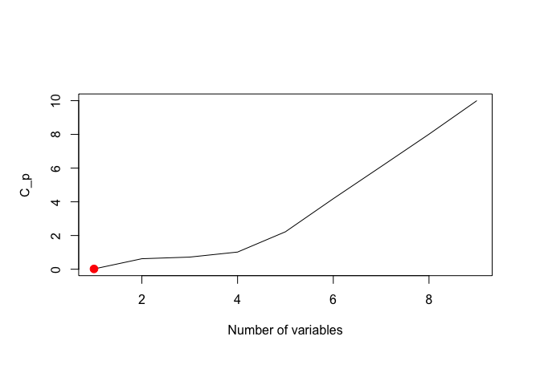<!-- -->

```r
plot(reg.summary$bic, xlab = "Number of variables", ylab = "BIC", type = "l")
points(which.min(reg.summary$bic), reg.summary$bic[which.min(reg.summary$bic)], col = "red", cex = 2, pch = 20)
```

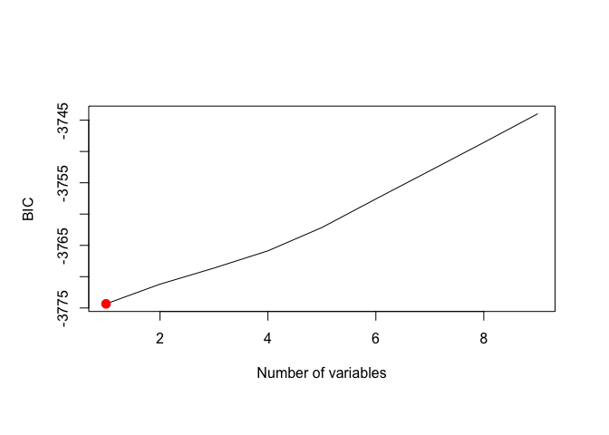<!-- -->

```r
plot(reg.summary$adjr2, xlab = "Number of variables", ylab = "Adjusted R^2", type = "l")
points(which.max(reg.summary$adjr2), reg.summary$adjr2[which.max(reg.summary$adjr2)], col = "red", cex = 2, pch = 20)
```

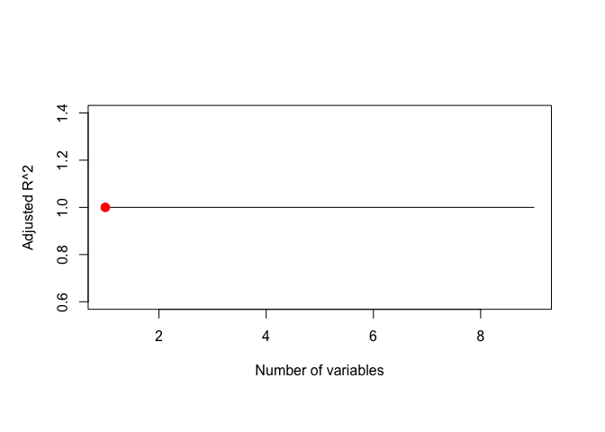<!-- -->

```r
# coeff
coef(regfit.full,9)
```

```
##          (Intercept) poly(x, 9, raw = T)1 poly(x, 9, raw = T)2 
##        -1.890994e+03         0.000000e+00         7.981624e+02 
## poly(x, 9, raw = T)3 poly(x, 9, raw = T)4 poly(x, 9, raw = T)5 
##        -4.000912e+02         9.621655e+01        -1.363882e+01 
## poly(x, 9, raw = T)6 poly(x, 9, raw = T)7 poly(x, 9, raw = T)8 
##         1.201510e+00         1.935062e+00         1.978324e-03 
## poly(x, 9, raw = T)9 
##        -2.607619e-05
```

```r
coef(regfit.fwd,9)
```

```
##          (Intercept) poly(x, 9, raw = T)1 poly(x, 9, raw = T)2 
##        -5.834087e+03         3.802243e+03        -8.214523e+02 
## poly(x, 9, raw = T)3 poly(x, 9, raw = T)4 poly(x, 9, raw = T)5 
##         0.000000e+00         3.303719e+01        -7.023649e+00 
## poly(x, 9, raw = T)6 poly(x, 9, raw = T)7 poly(x, 9, raw = T)8 
##         7.421686e-01         1.955463e+00         1.452412e-03 
## poly(x, 9, raw = T)9 
##        -2.007925e-05
```

```r
coef(regfit.bwd,9)
```

```
##          (Intercept) poly(x, 9, raw = T)1 poly(x, 9, raw = T)2 
##         5.156018e+05        -4.727308e+05         1.921175e+05 
## poly(x, 9, raw = T)3 poly(x, 9, raw = T)4 poly(x, 9, raw = T)5 
##        -4.542411e+04         6.886294e+03        -6.941773e+02 
## poly(x, 9, raw = T)6 poly(x, 9, raw = T)7 poly(x, 9, raw = T)8 
##         4.653169e+01         0.000000e+00         5.001676e-02 
## poly(x, 9, raw = T)9 
##        -5.544996e-04
```

```r
coef(cv.glmnet(xmat.ex9, data2$y, alpha = 1),10)[1:10]
```

```
##  [1] 5.073597e+05 0.000000e+00 0.000000e+00 0.000000e+00 0.000000e+00
##  [6] 0.000000e+00 1.484092e+00 1.796798e+00 2.072892e-03 3.330202e-06
```

```r
plot(data2$x,data2$y)
```

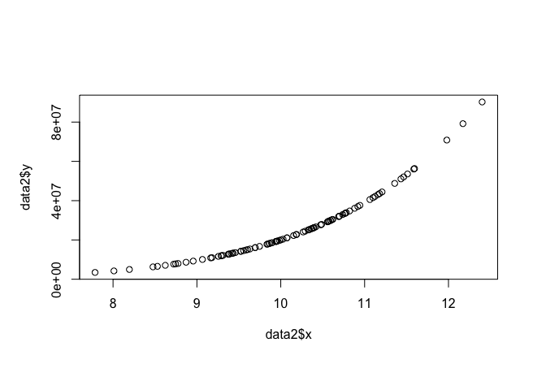<!-- -->

```r
cv.out<-cv.glmnet(xmat.ex9, data2$y, alpha = 1)
predict(glmnet(xmat.ex9, data2$y, alpha = 1),newx=xmat.ex9[1:5,],s= cv.out$lambda.min)
```

```
##          1
## 1 13098260
## 2 22823740
## 3 11285214
## 4 55352096
## 5 25130464
```

```r
data2[1:5,]
```

```
##           x        y
## 1  9.373546 12716209
## 2 10.183643 22717073
## 3  9.164371 10857979
## 4 11.595281 56363627
## 5 10.329508 25095016
```

```r
# 
plot(regfit.full, scale="Cp")
```

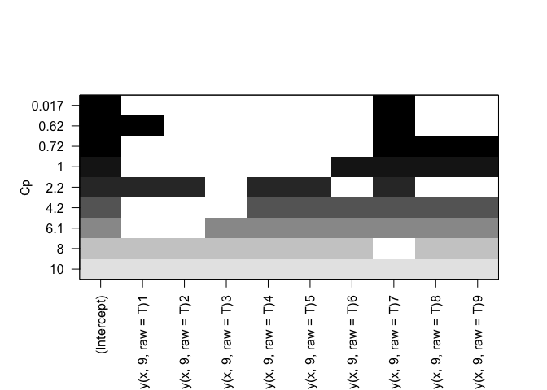<!-- -->

```r
plot(regfit.full, scale="bic")
```

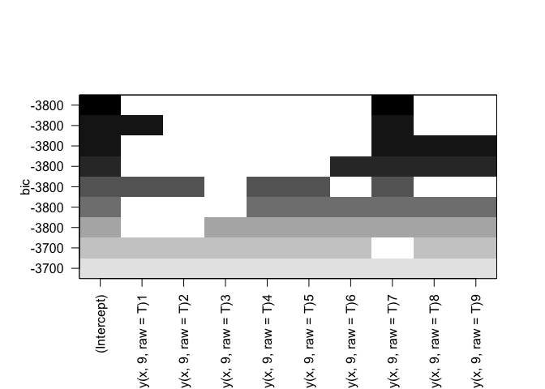<!-- -->

```r
plot(regfit.full, scale="adjr2")
```

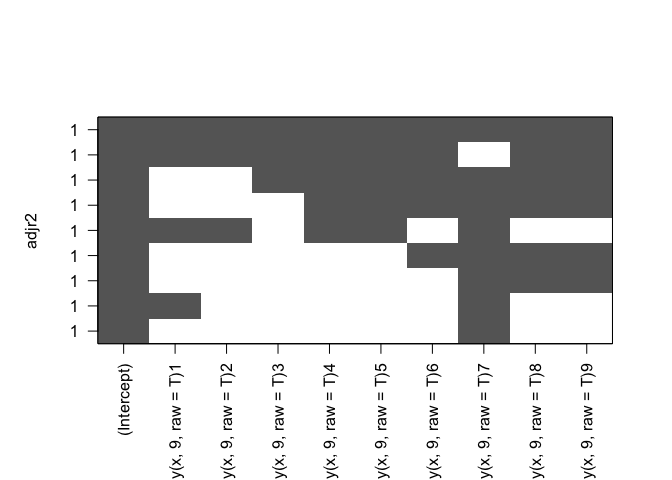<!-- -->

```r
#
plot(cv.glmnet(xmat.ex9, data2$y, alpha = 1)) # lambda.min is 500735.2
```

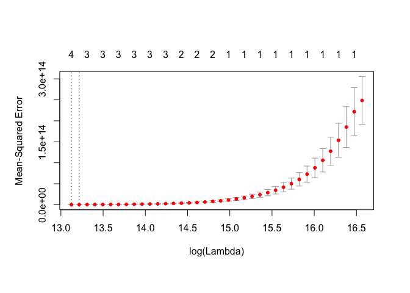<!-- -->

```r
plot(glmnet(xmat.ex9, data2$y, alpha = 1),xvar = "lambda", label = TRUE)
```

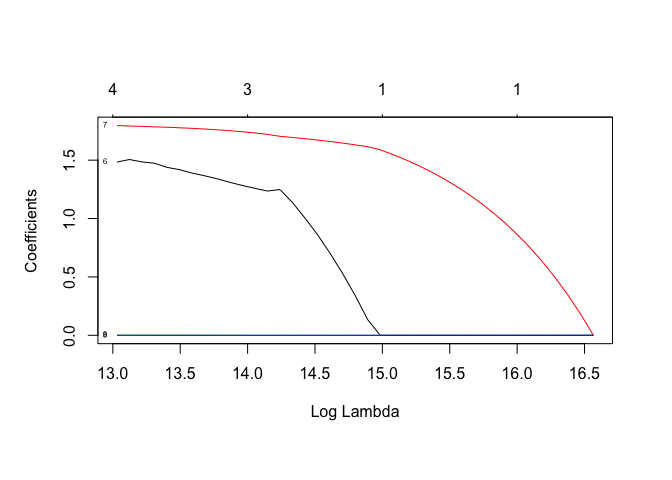<!-- -->
# 9 d
# 9 In this exercise, we will predict the number of applications received using the other variables in the College data set.

```r
# (a) Split the data set into a training set and a test set.
set.seed(1)
summary(College)
```

```
##  Private        Apps           Accept          Enroll       Top10perc    
##  No :212   Min.   :   81   Min.   :   72   Min.   :  35   Min.   : 1.00  
##  Yes:565   1st Qu.:  776   1st Qu.:  604   1st Qu.: 242   1st Qu.:15.00  
##            Median : 1558   Median : 1110   Median : 434   Median :23.00  
##            Mean   : 3002   Mean   : 2019   Mean   : 780   Mean   :27.56  
##            3rd Qu.: 3624   3rd Qu.: 2424   3rd Qu.: 902   3rd Qu.:35.00  
##            Max.   :48094   Max.   :26330   Max.   :6392   Max.   :96.00  
##    Top25perc      F.Undergrad     P.Undergrad         Outstate    
##  Min.   :  9.0   Min.   :  139   Min.   :    1.0   Min.   : 2340  
##  1st Qu.: 41.0   1st Qu.:  992   1st Qu.:   95.0   1st Qu.: 7320  
##  Median : 54.0   Median : 1707   Median :  353.0   Median : 9990  
##  Mean   : 55.8   Mean   : 3700   Mean   :  855.3   Mean   :10441  
##  3rd Qu.: 69.0   3rd Qu.: 4005   3rd Qu.:  967.0   3rd Qu.:12925  
##  Max.   :100.0   Max.   :31643   Max.   :21836.0   Max.   :21700  
##    Room.Board       Books           Personal         PhD        
##  Min.   :1780   Min.   :  96.0   Min.   : 250   Min.   :  8.00  
##  1st Qu.:3597   1st Qu.: 470.0   1st Qu.: 850   1st Qu.: 62.00  
##  Median :4200   Median : 500.0   Median :1200   Median : 75.00  
##  Mean   :4358   Mean   : 549.4   Mean   :1341   Mean   : 72.66  
##  3rd Qu.:5050   3rd Qu.: 600.0   3rd Qu.:1700   3rd Qu.: 85.00  
##  Max.   :8124   Max.   :2340.0   Max.   :6800   Max.   :103.00  
##     Terminal       S.F.Ratio      perc.alumni        Expend     
##  Min.   : 24.0   Min.   : 2.50   Min.   : 0.00   Min.   : 3186  
##  1st Qu.: 71.0   1st Qu.:11.50   1st Qu.:13.00   1st Qu.: 6751  
##  Median : 82.0   Median :13.60   Median :21.00   Median : 8377  
##  Mean   : 79.7   Mean   :14.09   Mean   :22.74   Mean   : 9660  
##  3rd Qu.: 92.0   3rd Qu.:16.50   3rd Qu.:31.00   3rd Qu.:10830  
##  Max.   :100.0   Max.   :39.80   Max.   :64.00   Max.   :56233  
##    Grad.Rate     
##  Min.   : 10.00  
##  1st Qu.: 53.00  
##  Median : 65.00  
##  Mean   : 65.46  
##  3rd Qu.: 78.00  
##  Max.   :118.00
```

```r
#x=model.matrix(Apps~.,College)[,-1] # Remove the first column, (Intercept)
x=model.matrix(Apps~.,College) # Does not remove the first column, (Intercept)
y=College$Apps
dim(x) # 777 17
```

```
## [1] 777  18
```

```r
set.seed(1)
train=sample(c(TRUE,FALSE), nrow(College),rep=TRUE)
test=(!train)
# train=sample(1:nrow(x), nrow(x)/2) # divide into two. glmnet vignet way
# test=(-train) # interesting way found in glmet vignet?
x.test=x[test,]
# x.train=x[train,]
y.test=y[test]
# y.train=y[train]
# (b) Fit a linear model using least squares on the training set, and report the test error obtained.
colnames(College)
```

```
##  [1] "Private"     "Apps"        "Accept"      "Enroll"      "Top10perc"  
##  [6] "Top25perc"   "F.Undergrad" "P.Undergrad" "Outstate"    "Room.Board" 
## [11] "Books"       "Personal"    "PhD"         "Terminal"    "S.F.Ratio"  
## [16] "perc.alumni" "Expend"      "Grad.Rate"
```

```r
sum(is.na(College)) # no NA
```

```
## [1] 0
```

```r
# use regsubsets()
regfit.best<-regsubsets(Apps~.,data=College[train,],nvmax=17)
summary(regfit.best)
```

```
## Subset selection object
## Call: regsubsets.formula(Apps ~ ., data = College[train, ], nvmax = 17)
## 17 Variables  (and intercept)
##             Forced in Forced out
## PrivateYes      FALSE      FALSE
## Accept          FALSE      FALSE
## Enroll          FALSE      FALSE
## Top10perc       FALSE      FALSE
## Top25perc       FALSE      FALSE
## F.Undergrad     FALSE      FALSE
## P.Undergrad     FALSE      FALSE
## Outstate        FALSE      FALSE
## Room.Board      FALSE      FALSE
## Books           FALSE      FALSE
## Personal        FALSE      FALSE
## PhD             FALSE      FALSE
## Terminal        FALSE      FALSE
## S.F.Ratio       FALSE      FALSE
## perc.alumni     FALSE      FALSE
## Expend          FALSE      FALSE
## Grad.Rate       FALSE      FALSE
## 1 subsets of each size up to 17
## Selection Algorithm: exhaustive
##           PrivateYes Accept Enroll Top10perc Top25perc F.Undergrad
## 1  ( 1 )  " "        "*"    " "    " "       " "       " "        
## 2  ( 1 )  " "        "*"    " "    "*"       " "       " "        
## 3  ( 1 )  " "        "*"    " "    "*"       " "       " "        
## 4  ( 1 )  "*"        "*"    " "    "*"       " "       " "        
## 5  ( 1 )  "*"        "*"    " "    "*"       "*"       " "        
## 6  ( 1 )  "*"        "*"    " "    "*"       "*"       "*"        
## 7  ( 1 )  "*"        "*"    " "    "*"       "*"       "*"        
## 8  ( 1 )  "*"        "*"    " "    "*"       "*"       "*"        
## 9  ( 1 )  "*"        "*"    " "    "*"       "*"       "*"        
## 10  ( 1 ) "*"        "*"    " "    "*"       "*"       "*"        
## 11  ( 1 ) "*"        "*"    "*"    "*"       "*"       "*"        
## 12  ( 1 ) "*"        "*"    "*"    "*"       "*"       "*"        
## 13  ( 1 ) "*"        "*"    "*"    "*"       "*"       "*"        
## 14  ( 1 ) "*"        "*"    "*"    "*"       "*"       "*"        
## 15  ( 1 ) "*"        "*"    "*"    "*"       "*"       "*"        
## 16  ( 1 ) "*"        "*"    "*"    "*"       "*"       "*"        
## 17  ( 1 ) "*"        "*"    "*"    "*"       "*"       "*"        
##           P.Undergrad Outstate Room.Board Books Personal PhD Terminal
## 1  ( 1 )  " "         " "      " "        " "   " "      " " " "     
## 2  ( 1 )  " "         " "      " "        " "   " "      " " " "     
## 3  ( 1 )  " "         " "      " "        " "   " "      " " " "     
## 4  ( 1 )  " "         " "      " "        " "   " "      " " " "     
## 5  ( 1 )  " "         " "      " "        " "   " "      " " " "     
## 6  ( 1 )  " "         " "      " "        " "   " "      " " " "     
## 7  ( 1 )  " "         " "      "*"        " "   " "      " " " "     
## 8  ( 1 )  " "         " "      "*"        " "   " "      "*" " "     
## 9  ( 1 )  " "         " "      "*"        " "   "*"      "*" " "     
## 10  ( 1 ) " "         " "      "*"        " "   "*"      "*" " "     
## 11  ( 1 ) " "         " "      "*"        " "   "*"      "*" " "     
## 12  ( 1 ) " "         "*"      "*"        " "   "*"      "*" " "     
## 13  ( 1 ) " "         "*"      "*"        " "   "*"      "*" " "     
## 14  ( 1 ) "*"         "*"      "*"        " "   "*"      "*" " "     
## 15  ( 1 ) "*"         "*"      "*"        "*"   "*"      "*" " "     
## 16  ( 1 ) "*"         "*"      "*"        "*"   "*"      "*" " "     
## 17  ( 1 ) "*"         "*"      "*"        "*"   "*"      "*" "*"     
##           S.F.Ratio perc.alumni Expend Grad.Rate
## 1  ( 1 )  " "       " "         " "    " "      
## 2  ( 1 )  " "       " "         " "    " "      
## 3  ( 1 )  " "       " "         "*"    " "      
## 4  ( 1 )  " "       " "         "*"    " "      
## 5  ( 1 )  " "       " "         "*"    " "      
## 6  ( 1 )  " "       " "         "*"    " "      
## 7  ( 1 )  " "       " "         "*"    " "      
## 8  ( 1 )  " "       " "         "*"    " "      
## 9  ( 1 )  " "       " "         "*"    " "      
## 10  ( 1 ) " "       " "         "*"    "*"      
## 11  ( 1 ) " "       " "         "*"    "*"      
## 12  ( 1 ) " "       " "         "*"    "*"      
## 13  ( 1 ) " "       "*"         "*"    "*"      
## 14  ( 1 ) " "       "*"         "*"    "*"      
## 15  ( 1 ) " "       "*"         "*"    "*"      
## 16  ( 1 ) "*"       "*"         "*"    "*"      
## 17  ( 1 ) "*"       "*"         "*"    "*"
```

```r
plot(regfit.best)
```

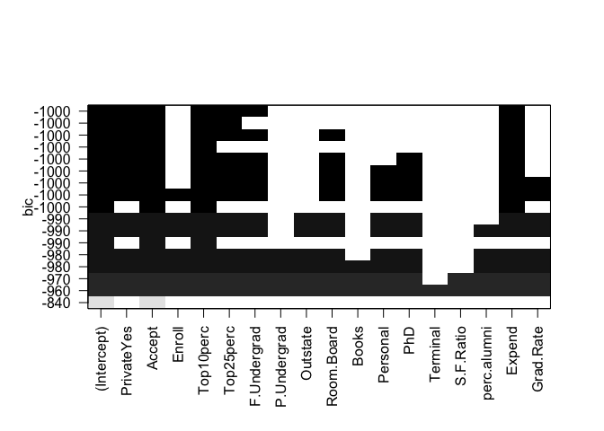<!-- -->

```r
#
val.errors=rep(NA,17)
for(i in 1:17){
   coefi=coef(regfit.best,id=i)
   pred=x.test[,names(coefi)]%*%coefi
   val.errors[i]=mean((College$Apps[test]-pred)^2)
}
val.errors
```

```
##  [1] 1714544 1542316 1510924 1512552 1492114 1635683 1645549 1610020
##  [9] 1626584 1616854 1555953 1520681 1526317 1519996 1522719 1520481
## [17] 1520331
```

```r
which.min(val.errors) # 5
```

```
## [1] 5
```

```r
# MSE. There is no predict function for this
#mean((predict(summary(rigfit.full),newx=x.test)-y.test)^2)
coef(regfit.best,5)
```

```
##   (Intercept)    PrivateYes        Accept     Top10perc     Top25perc 
## -114.81292106 -617.07313758    1.28203523   50.65442163  -16.79622599 
##        Expend 
##    0.05489076
```

```r
# from text book
predict.regsubsets=function(object,newdata,id,...){
  form=as.formula(object$call[[2]])
  mat=model.matrix(form,newdata)
  coefi=coef(object,id=id)
  xvars=names(coefi)
  mat[,xvars]%*%coefi
}
as.formula(regfit.best$call[[2]])
```

```
## Apps ~ .
```

```r
coef(regfit.best,id=5)
```

```
##   (Intercept)    PrivateYes        Accept     Top10perc     Top25perc 
## -114.81292106 -617.07313758    1.28203523   50.65442163  -16.79622599 
##        Expend 
##    0.05489076
```

```r
predict.regsubsets.test<-predict.regsubsets(regfit.best,newdata=College[test,],id=5)
length(predict.regsubsets.test) # 377
```

```
## [1] 377
```

```r
#
lm.train<-lm(Apps~., data=College,subset=train)
summary(lm.train)
```

```
## 
## Call:
## lm(formula = Apps ~ ., data = College, subset = train)
## 
## Residuals:
##     Min      1Q  Median      3Q     Max 
## -2485.0  -392.4   -57.9   261.6  6637.3 
## 
## Coefficients:
##               Estimate Std. Error t value Pr(>|t|)    
## (Intercept) -756.88732  535.44217  -1.414 0.158301    
## PrivateYes  -515.36459  190.44202  -2.706 0.007112 ** 
## Accept         1.20916    0.07046  17.161  < 2e-16 ***
## Enroll        -0.29026    0.23380  -1.241 0.215188    
## Top10perc     52.53768    7.69358   6.829 3.38e-11 ***
## Top25perc    -16.38973    6.09706  -2.688 0.007500 ** 
## F.Undergrad    0.09625    0.04103   2.346 0.019495 *  
## P.Undergrad    0.02831    0.05417   0.523 0.601540    
## Outstate      -0.02161    0.02599  -0.831 0.406262    
## Room.Board     0.13204    0.06968   1.895 0.058847 .  
## Books          0.16642    0.34092   0.488 0.625726    
## Personal       0.16409    0.09270   1.770 0.077519 .  
## PhD           -8.51810    6.73921  -1.264 0.207015    
## Terminal      -0.35379    7.43056  -0.048 0.962049    
## S.F.Ratio      3.79436   16.20785   0.234 0.815028    
## perc.alumni   -2.86286    5.56666  -0.514 0.607349    
## Expend         0.05855    0.01528   3.832 0.000148 ***
## Grad.Rate      7.14929    3.91090   1.828 0.068323 .  
## ---
## Signif. codes:  0 '***' 0.001 '**' 0.01 '*' 0.05 '.' 0.1 ' ' 1
## 
## Residual standard error: 1001 on 382 degrees of freedom
## Multiple R-squared:  0.9314,	Adjusted R-squared:  0.9283 
## F-statistic: 304.9 on 17 and 382 DF,  p-value: < 2.2e-16
```

```r
pred.lm<-predict(lm.train,newdata=College[test,-2]) # does not work
length(pred.lm) # 400
```

```
## [1] 377
```

```r
dim(College[test,])
```

```
## [1] 377  18
```

```r
library(reshape2)
melt.data<-melt(cbind(data.frame(pred.lm=pred.lm,pred.regsubsets=predict.regsubsets.test),Apps=College[test,2]),id="Apps")
str(melt.data)
```

```
## 'data.frame':	754 obs. of  3 variables:
##  $ Apps    : num  1428 417 587 353 1899 ...
##  $ variable: Factor w/ 2 levels "pred.lm","pred.regsubsets": 1 1 1 1 1 1 1 1 1 1 ...
##  $ value   : num  1291 2153 1021 247 2548 ...
```

```r
library(ggplot2)
ggplot(melt.data,aes(x=Apps,y=value,colour=variable,alpha=0.1)) + geom_point()
```

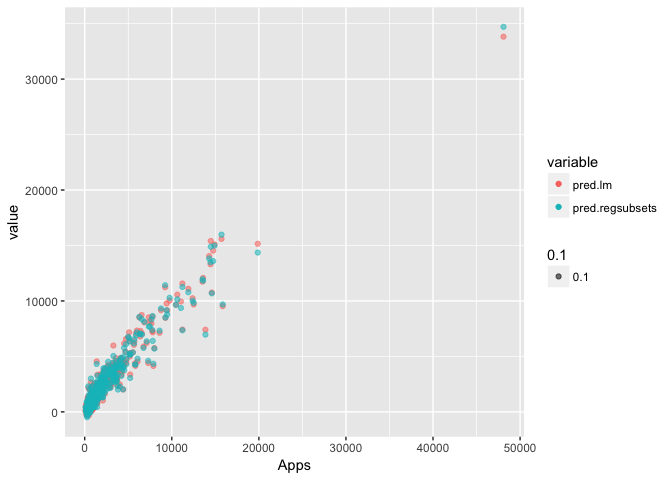<!-- -->

```r
# MSE 
mean((pred.lm - College[test,"Apps"])^2) # 1520331 for lm
```

```
## [1] 1520331
```

```r
mean((predict.regsubsets.test - College[test,"Apps"])^2) # 1492114 for regsubsets
```

```
## [1] 1492114
```

```r
# (c) Fit a ridge regression model on the training set, with λ chosen by cross-validation. Report the test error obtained
library(glmnet)

#ridge.mod=glmnet(x,y,alpha=0,lambda=grid) # If alpha=0 then a ridge regression model is fit, and if alpha=1 then a lasso model is fit. 
# Recall from Chapter 3 that the least squares fitting procedure estimates β0,β1,...,βp using the values that minimize: RSS (residual sum of squares, Fig3.1, p62)
ridge.ex9=glmnet(College[train,-2],College[train,"Apps"],alpha=0) # error
```

```
## Error in elnet(x, is.sparse, ix, jx, y, weights, offset, type.gaussian, : (list) object cannot be coerced to type 'double'
```

```r
ridge.ex9=glmnet(x[train,-1],College[train,"Apps"],alpha=0) # removing intercept in x
cv.ridge.ex9<-cv.glmnet(x[train,-1],College[train,"Apps"],alpha=0)
predict(cv.ridge.ex9,s=cv.ridge.ex9$lambda.min,exact=T,type="coefficients")[1:18,] # coefficients
```

```
##   (Intercept)    PrivateYes        Accept        Enroll     Top10perc 
## -1.664996e+03 -5.297808e+02  6.813764e-01  7.234276e-01  2.863680e+01 
##     Top25perc   F.Undergrad   P.Undergrad      Outstate    Room.Board 
##  1.200423e-01  1.393404e-01  1.761140e-02  1.582575e-02  1.799726e-01 
##         Books      Personal           PhD      Terminal     S.F.Ratio 
##  2.814644e-01  8.715456e-02 -2.792170e+00 -2.505627e+00  3.181125e-01 
##   perc.alumni        Expend     Grad.Rate 
## -9.606178e+00  6.615508e-02  8.986881e+00
```

```r
ridge.predict.ex9<-predict(cv.ridge.ex9,s=cv.ridge.ex9$lambda.min,newx=x[test,-1])
# MSE
mean((ridge.predict.ex9 - College[test,"Apps"])^2) # 2585067
```

```
## [1] 2585067
```

```r
# (d) Fit a lasso model on the training set, with λ chosen by cross- validation. Report the test error obtained, along with the number of non-zero coefficient estimates.
lasso.ex9=glmnet(x[train,-1],College[train,"Apps"],alpha=1) # removing intercept in x
cv.lasso.ex9<-cv.glmnet(x[train,-1],College[train,"Apps"],alpha=1)
lasso.ex9.coef<-predict(cv.lasso.ex9,s=cv.lasso.ex9$lambda.min,exact=T,type="coefficients")[1:18,] # coefficients
lasso.ex9.coef[!lasso.ex9.coef==0] #non zero
```

```
##   (Intercept)    PrivateYes        Accept     Top10perc     Top25perc 
## -8.799363e+02 -4.896148e+02  1.149003e+00  4.239582e+01 -8.445945e+00 
##   F.Undergrad   P.Undergrad      Outstate    Room.Board         Books 
##  6.966387e-02  2.046204e-02 -1.612278e-03  1.011751e-01  1.101042e-01 
##      Personal           PhD   perc.alumni        Expend     Grad.Rate 
##  1.428072e-01 -6.834184e+00 -3.502265e+00  5.578810e-02  5.123789e+00
```

```r
lasso.ex9.coef[lasso.ex9.coef!=0] #non zero. this is also OK.
```

```
##   (Intercept)    PrivateYes        Accept     Top10perc     Top25perc 
## -8.799363e+02 -4.896148e+02  1.149003e+00  4.239582e+01 -8.445945e+00 
##   F.Undergrad   P.Undergrad      Outstate    Room.Board         Books 
##  6.966387e-02  2.046204e-02 -1.612278e-03  1.011751e-01  1.101042e-01 
##      Personal           PhD   perc.alumni        Expend     Grad.Rate 
##  1.428072e-01 -6.834184e+00 -3.502265e+00  5.578810e-02  5.123789e+00
```

```r
lasso.predict.ex9<-predict(cv.lasso.ex9,s=cv.ridge.ex9$lambda.min,newx=x[test,-1])
# MSE
mean((lasso.predict.ex9 - College[test,"Apps"])^2) # 2010635. smaller than ridge
```

```
## [1] 2010635
```
# 11 a,b,c, for all but PCR; we will add that next week.

