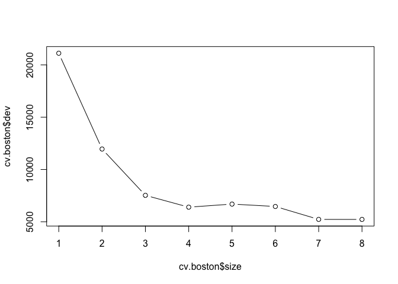

# Chapter 8 Lab: Decision Trees

```r
# Fitting Classification Trees
High=ifelse(Sales<=8,"No","Yes")
Carseats=data.frame(Carseats,High)
tree.carseats=tree(High~.-Sales,Carseats)
summary(tree.carseats)
```

```
## 
## Classification tree:
## tree(formula = High ~ . - Sales, data = Carseats)
## Variables actually used in tree construction:
## [1] "ShelveLoc"   "Price"       "Income"      "CompPrice"   "Population" 
## [6] "Advertising" "Age"         "US"         
## Number of terminal nodes:  27 
## Residual mean deviance:  0.4575 = 170.7 / 373 
## Misclassification error rate: 0.09 = 36 / 400
```

```r
plot(tree.carseats)
text(tree.carseats,pretty=0)
```

<!-- -->

```r
tree.carseats
```

```
## node), split, n, deviance, yval, (yprob)
##       * denotes terminal node
## 
##   1) root 400 541.500 No ( 0.59000 0.41000 )  
##     2) ShelveLoc: Bad,Medium 315 390.600 No ( 0.68889 0.31111 )  
##       4) Price < 92.5 46  56.530 Yes ( 0.30435 0.69565 )  
##         8) Income < 57 10  12.220 No ( 0.70000 0.30000 )  
##          16) CompPrice < 110.5 5   0.000 No ( 1.00000 0.00000 ) *
##          17) CompPrice > 110.5 5   6.730 Yes ( 0.40000 0.60000 ) *
##         9) Income > 57 36  35.470 Yes ( 0.19444 0.80556 )  
##          18) Population < 207.5 16  21.170 Yes ( 0.37500 0.62500 ) *
##          19) Population > 207.5 20   7.941 Yes ( 0.05000 0.95000 ) *
##       5) Price > 92.5 269 299.800 No ( 0.75465 0.24535 )  
##        10) Advertising < 13.5 224 213.200 No ( 0.81696 0.18304 )  
##          20) CompPrice < 124.5 96  44.890 No ( 0.93750 0.06250 )  
##            40) Price < 106.5 38  33.150 No ( 0.84211 0.15789 )  
##              80) Population < 177 12  16.300 No ( 0.58333 0.41667 )  
##               160) Income < 60.5 6   0.000 No ( 1.00000 0.00000 ) *
##               161) Income > 60.5 6   5.407 Yes ( 0.16667 0.83333 ) *
##              81) Population > 177 26   8.477 No ( 0.96154 0.03846 ) *
##            41) Price > 106.5 58   0.000 No ( 1.00000 0.00000 ) *
##          21) CompPrice > 124.5 128 150.200 No ( 0.72656 0.27344 )  
##            42) Price < 122.5 51  70.680 Yes ( 0.49020 0.50980 )  
##              84) ShelveLoc: Bad 11   6.702 No ( 0.90909 0.09091 ) *
##              85) ShelveLoc: Medium 40  52.930 Yes ( 0.37500 0.62500 )  
##               170) Price < 109.5 16   7.481 Yes ( 0.06250 0.93750 ) *
##               171) Price > 109.5 24  32.600 No ( 0.58333 0.41667 )  
##                 342) Age < 49.5 13  16.050 Yes ( 0.30769 0.69231 ) *
##                 343) Age > 49.5 11   6.702 No ( 0.90909 0.09091 ) *
##            43) Price > 122.5 77  55.540 No ( 0.88312 0.11688 )  
##              86) CompPrice < 147.5 58  17.400 No ( 0.96552 0.03448 ) *
##              87) CompPrice > 147.5 19  25.010 No ( 0.63158 0.36842 )  
##               174) Price < 147 12  16.300 Yes ( 0.41667 0.58333 )  
##                 348) CompPrice < 152.5 7   5.742 Yes ( 0.14286 0.85714 ) *
##                 349) CompPrice > 152.5 5   5.004 No ( 0.80000 0.20000 ) *
##               175) Price > 147 7   0.000 No ( 1.00000 0.00000 ) *
##        11) Advertising > 13.5 45  61.830 Yes ( 0.44444 0.55556 )  
##          22) Age < 54.5 25  25.020 Yes ( 0.20000 0.80000 )  
##            44) CompPrice < 130.5 14  18.250 Yes ( 0.35714 0.64286 )  
##              88) Income < 100 9  12.370 No ( 0.55556 0.44444 ) *
##              89) Income > 100 5   0.000 Yes ( 0.00000 1.00000 ) *
##            45) CompPrice > 130.5 11   0.000 Yes ( 0.00000 1.00000 ) *
##          23) Age > 54.5 20  22.490 No ( 0.75000 0.25000 )  
##            46) CompPrice < 122.5 10   0.000 No ( 1.00000 0.00000 ) *
##            47) CompPrice > 122.5 10  13.860 No ( 0.50000 0.50000 )  
##              94) Price < 125 5   0.000 Yes ( 0.00000 1.00000 ) *
##              95) Price > 125 5   0.000 No ( 1.00000 0.00000 ) *
##     3) ShelveLoc: Good 85  90.330 Yes ( 0.22353 0.77647 )  
##       6) Price < 135 68  49.260 Yes ( 0.11765 0.88235 )  
##        12) US: No 17  22.070 Yes ( 0.35294 0.64706 )  
##          24) Price < 109 8   0.000 Yes ( 0.00000 1.00000 ) *
##          25) Price > 109 9  11.460 No ( 0.66667 0.33333 ) *
##        13) US: Yes 51  16.880 Yes ( 0.03922 0.96078 ) *
##       7) Price > 135 17  22.070 No ( 0.64706 0.35294 )  
##        14) Income < 46 6   0.000 No ( 1.00000 0.00000 ) *
##        15) Income > 46 11  15.160 Yes ( 0.45455 0.54545 ) *
```

```r
set.seed(2)
train=sample(1:nrow(Carseats), 200)
Carseats.test=Carseats[-train,]
High.test=High[-train]
tree.carseats=tree(High~.-Sales,Carseats,subset=train)
tree.pred=predict(tree.carseats,Carseats.test,type="class")
table(tree.pred,High.test)
```

```
##          High.test
## tree.pred No Yes
##       No  86  27
##       Yes 30  57
```

```r
(86+57)/200
```

```
## [1] 0.715
```

```r
# Next, we consider whether pruning the tree might lead to improved results. The function cv.tree() performs cross-validation in order to determine the optimal level of tree complexity; cost complexity pruning is used in order to select a sequence of trees for consideration. We use the argument FUN=prune.misclass in order to indicate that we want the classification error rate to guide the cross-validation and pruning process, rather than the default for the cv.tree() function, which is deviance. The cv.tree() function reports the number of terminal nodes of each tree con- sidered (size) as well as the corresponding error rate and the value of the cost-complexity parameter used (k, which corresponds to α in (8.4)).  
set.seed(3)
cv.carseats=cv.tree(tree.carseats,FUN=prune.misclass)
names(cv.carseats)
```

```
## [1] "size"   "dev"    "k"      "method"
```

```r
cv.carseats
```

```
## $size
## [1] 19 17 14 13  9  7  3  2  1
## 
## $dev
## [1] 55 55 53 52 50 56 69 65 80
## 
## $k
## [1]       -Inf  0.0000000  0.6666667  1.0000000  1.7500000  2.0000000
## [7]  4.2500000  5.0000000 23.0000000
## 
## $method
## [1] "misclass"
## 
## attr(,"class")
## [1] "prune"         "tree.sequence"
```

```r
par(mfrow=c(1,2))
plot(cv.carseats$size,cv.carseats$dev,type="b")
plot(cv.carseats$k,cv.carseats$dev,type="b")
```

<!-- -->

```r
prune.carseats=prune.misclass(tree.carseats,best=9)
plot(prune.carseats)
text(prune.carseats,pretty=0)
tree.pred=predict(prune.carseats,Carseats.test,type="class")
table(tree.pred,High.test)
```

```
##          High.test
## tree.pred No Yes
##       No  94  24
##       Yes 22  60
```

```r
(94+60)/200
```

```
## [1] 0.77
```

```r
prune.carseats=prune.misclass(tree.carseats,best=15)
plot(prune.carseats)
text(prune.carseats,pretty=0)
```

<!-- -->

```r
tree.pred=predict(prune.carseats,Carseats.test,type="class")
table(tree.pred,High.test)
```

```
##          High.test
## tree.pred No Yes
##       No  86  22
##       Yes 30  62
```

```r
(86+62)/200
```

```
## [1] 0.74
```
# 8.3.2 Fitting Regression Trees

```r
library(MASS)
set.seed(1)
train = sample(1:nrow(Boston), nrow(Boston)/2)
tree.boston=tree(medv~.,Boston,subset=train)
summary(tree.boston)
```

```
## 
## Regression tree:
## tree(formula = medv ~ ., data = Boston, subset = train)
## Variables actually used in tree construction:
## [1] "lstat" "rm"    "dis"  
## Number of terminal nodes:  8 
## Residual mean deviance:  12.65 = 3099 / 245 
## Distribution of residuals:
##      Min.   1st Qu.    Median      Mean   3rd Qu.      Max. 
## -14.10000  -2.04200  -0.05357   0.00000   1.96000  12.60000
```

```r
plot(tree.boston)
text(tree.boston,pretty=0)
```

<!-- -->

```r
cv.boston=cv.tree(tree.boston)
plot(cv.boston$size,cv.boston$dev,type='b')
```

<!-- -->

```r
prune.boston=prune.tree(tree.boston,best=5)
plot(prune.boston)
text(prune.boston,pretty=0)
```

<!-- -->

```r
yhat=predict(tree.boston,newdata=Boston[-train,])
boston.test=Boston[-train,"medv"]
plot(yhat,boston.test)
abline(0,1)
```

<!-- -->

```r
mean((yhat-boston.test)^2)
```

```
## [1] 25.04559
```
# 8.3.3 Bagging and Random Forests

```r
library(randomForest)
```

```
## randomForest 4.6-12
```

```
## Type rfNews() to see new features/changes/bug fixes.
```

```r
# Recall that bagging is simply a special case of a random forest with m = p. 
set.seed(1)
bag.boston=randomForest(medv~.,data=Boston,subset=train,mtry=13,importance=TRUE)
bag.boston
```

```
## 
## Call:
##  randomForest(formula = medv ~ ., data = Boston, mtry = 13, importance = TRUE,      subset = train) 
##                Type of random forest: regression
##                      Number of trees: 500
## No. of variables tried at each split: 13
## 
##           Mean of squared residuals: 11.02509
##                     % Var explained: 86.65
```

```r
# The argument mtry=13 indicates that all 13 predictors should be considered for each split of the tree—in other words, that bagging should be done. How well does this bagged model perform on the test set?
yhat.bag = predict(bag.boston,newdata=Boston[-train,])
plot(yhat.bag, boston.test)
abline(0,1)
```

<!-- -->

```r
mean((yhat.bag-boston.test)^2)
```

```
## [1] 13.47349
```

```r
# The test set MSE associated with the bagged regression tree is 13.16, almost half that obtained using an optimally-pruned single tree. We could change the number of trees grown by randomForest() using the ntree argument:
bag.boston=randomForest(medv~.,data=Boston,subset=train,mtry=13,ntree=25)
yhat.bag = predict(bag.boston,newdata=Boston[-train,])
mean((yhat.bag-boston.test)^2)
```

```
## [1] 13.43068
```

```r
# Growing a random forest proceeds in exactly the same way, except that we use a smaller value of the mtry argument. By default, randomForest() uses p/3 variables when building a random forest of regression trees, and √p variables when building a random forest of classification trees. Here we use mtry = 6.
set.seed(1)
rf.boston=randomForest(medv~.,data=Boston,subset=train,mtry=6,importance=TRUE)
yhat.rf = predict(rf.boston,newdata=Boston[-train,])
mean((yhat.rf-boston.test)^2)
```

```
## [1] 11.48022
```

```r
# The test set MSE is 11.31; this indicates that random forests yielded an improvement over bagging in this case. Using the importance() function, we can view the importance of each importance() variable.
importance(rf.boston)
```

```
##           %IncMSE IncNodePurity
## crim    12.547772    1094.65382
## zn       1.375489      64.40060
## indus    9.304258    1086.09103
## chas     2.518766      76.36804
## nox     12.835614    1008.73703
## rm      31.646147    6705.02638
## age      9.970243     575.13702
## dis     12.774430    1351.01978
## rad      3.911852      93.78200
## tax      7.624043     453.19472
## ptratio 12.008194     919.06760
## black    7.376024     358.96935
## lstat   27.666896    6927.98475
```

```r
# Two measures of variable importance are reported. The former is based upon the mean decrease of accuracy in predictions on the out of bag samples when a given variable is excluded from the model. The latter is a measure of the total decrease in node impurity that results from splits over that variable, averaged over all trees (this was plotted in Figure 8.9). In the case of regression trees, the node impurity is measured by the training RSS, and for classification trees by the deviance. Plots of these importance measures can be produced using the varImpPlot() function.
varImpPlot(rf.boston)
```

<!-- -->
# 8.3.4 Boosting

```r
# Hereweusethegbmpackage,andwithinitthegbm()function,tofitboosted regression trees to the Boston data set. We run gbm() with the option distribution="gaussian" since this is a regression problem; if it were a bi- nary classification problem, we would use distribution="bernoulli". The argument n.trees=5000 indicates that we want 5000 trees, and the option interaction.depth=4 limits the depth of each tree.
library(gbm)
```

```
## Loading required package: survival
```

```
## Loading required package: lattice
```

```
## Loading required package: splines
```

```
## Loading required package: parallel
```

```
## Loaded gbm 2.1.3
```

```r
set.seed(1)
boost.boston=gbm(medv~.,data=Boston[train,],distribution="gaussian",n.trees=5000,interaction.depth=4)
summary(boost.boston)
```

<!-- -->

```
##             var    rel.inf
## lstat     lstat 45.9627334
## rm           rm 31.2238187
## dis         dis  6.8087398
## crim       crim  4.0743784
## nox         nox  2.5605001
## ptratio ptratio  2.2748652
## black     black  1.7971159
## age         age  1.6488532
## tax         tax  1.3595005
## indus     indus  1.2705924
## chas       chas  0.8014323
## rad         rad  0.2026619
## zn           zn  0.0148083
```

```r
par(mfrow=c(1,2))
plot(boost.boston,i="rm")
plot(boost.boston,i="lstat")
```

<!-- -->

```r
yhat.boost=predict(boost.boston,newdata=Boston[-train,],n.trees=5000)
mean((yhat.boost-boston.test)^2)
```

```
## [1] 11.84434
```

```r
boost.boston=gbm(medv~.,data=Boston[train,],distribution="gaussian",n.trees=5000,interaction.depth=4,shrinkage=0.2,verbose=F)
yhat.boost=predict(boost.boston,newdata=Boston[-train,],n.trees=5000)
mean((yhat.boost-boston.test)^2)
```

```
## [1] 11.51109
```

```r
detach()
```
# Exercise 1

# Ex 3


# Exercise 5.
## 5. Suppose we produce ten bootstrapped samples from a data set containing red and green classes. We then apply a classification tree to each bootstrapped sample and, for a specific value of X, produce 10 estimates of P(Class is Red|X): 0.1, 0.15, 0.2, 0.2, 0.55, 0.6, 0.6, 0.65, 0.7, and 0.75. 
## There are two common ways to combine these results together into a single class prediction. One is the majority vote approach discussed in this chapter. The second approach is to classify based on the average probability. In this example, what is the final classification under each of these two approaches?

# Ex 8 
## In the lab, a classification tree was applied to the Carseats data set after converting Sales into a qualitative response variable. Now we will seek to predict Sales using regression trees and related approaches, treating the response as a quantitative variable.

```r
# (a) Split the data set into a training set and a test set.
attach(Carseats)
```

```
## The following object is masked _by_ .GlobalEnv:
## 
##     High
```

```
## The following objects are masked from Carseats (pos = 9):
## 
##     Advertising, Age, CompPrice, Education, Income, Population,
##     Price, Sales, ShelveLoc, Urban, US
```

```r
summary(Carseats)
```

```
##      Sales          CompPrice       Income        Advertising    
##  Min.   : 0.000   Min.   : 77   Min.   : 21.00   Min.   : 0.000  
##  1st Qu.: 5.390   1st Qu.:115   1st Qu.: 42.75   1st Qu.: 0.000  
##  Median : 7.490   Median :125   Median : 69.00   Median : 5.000  
##  Mean   : 7.496   Mean   :125   Mean   : 68.66   Mean   : 6.635  
##  3rd Qu.: 9.320   3rd Qu.:135   3rd Qu.: 91.00   3rd Qu.:12.000  
##  Max.   :16.270   Max.   :175   Max.   :120.00   Max.   :29.000  
##    Population        Price        ShelveLoc        Age       
##  Min.   : 10.0   Min.   : 24.0   Bad   : 96   Min.   :25.00  
##  1st Qu.:139.0   1st Qu.:100.0   Good  : 85   1st Qu.:39.75  
##  Median :272.0   Median :117.0   Medium:219   Median :54.50  
##  Mean   :264.8   Mean   :115.8                Mean   :53.32  
##  3rd Qu.:398.5   3rd Qu.:131.0                3rd Qu.:66.00  
##  Max.   :509.0   Max.   :191.0                Max.   :80.00  
##    Education    Urban       US       High    
##  Min.   :10.0   No :118   No :142   No :236  
##  1st Qu.:12.0   Yes:282   Yes:258   Yes:164  
##  Median :14.0                                
##  Mean   :13.9                                
##  3rd Qu.:16.0                                
##  Max.   :18.0
```

```r
head(Carseats);dim(Carseats)
```

```
##   Sales CompPrice Income Advertising Population Price ShelveLoc Age
## 1  9.50       138     73          11        276   120       Bad  42
## 2 11.22       111     48          16        260    83      Good  65
## 3 10.06       113     35          10        269    80    Medium  59
## 4  7.40       117    100           4        466    97    Medium  55
## 5  4.15       141     64           3        340   128       Bad  38
## 6 10.81       124    113          13        501    72       Bad  78
##   Education Urban  US High
## 1        17   Yes Yes  Yes
## 2        10   Yes Yes  Yes
## 3        12   Yes Yes  Yes
## 4        14   Yes Yes   No
## 5        13   Yes  No   No
## 6        16    No Yes  Yes
```

```
## [1] 400  12
```

```r
str(Carseats)
```

```
## 'data.frame':	400 obs. of  12 variables:
##  $ Sales      : num  9.5 11.22 10.06 7.4 4.15 ...
##  $ CompPrice  : num  138 111 113 117 141 124 115 136 132 132 ...
##  $ Income     : num  73 48 35 100 64 113 105 81 110 113 ...
##  $ Advertising: num  11 16 10 4 3 13 0 15 0 0 ...
##  $ Population : num  276 260 269 466 340 501 45 425 108 131 ...
##  $ Price      : num  120 83 80 97 128 72 108 120 124 124 ...
##  $ ShelveLoc  : Factor w/ 3 levels "Bad","Good","Medium": 1 2 3 3 1 1 3 2 3 3 ...
##  $ Age        : num  42 65 59 55 38 78 71 67 76 76 ...
##  $ Education  : num  17 10 12 14 13 16 15 10 10 17 ...
##  $ Urban      : Factor w/ 2 levels "No","Yes": 2 2 2 2 2 1 2 2 1 1 ...
##  $ US         : Factor w/ 2 levels "No","Yes": 2 2 2 2 1 2 1 2 1 2 ...
##  $ High       : Factor w/ 2 levels "No","Yes": 2 2 2 1 1 2 1 2 1 1 ...
```

```r
Carseats$Sales<-as.numeric(Carseats$Sales) # converting Sales into a qualitative response variable
set.seed(1)
train = sample(1:nrow(Carseats), nrow(Carseats)/2)
Carseats.test=Carseats[-train,]
# (b) Fit a regression tree to the training set. Plot the tree, and interpret the results. What test MSE do you obtain?
tree.Carseats=tree(Sales~.,Carseats,subset=train)
summary(tree.Carseats) # Error in y - frame$yval[object$where] : non-numeric argument to binary operator when Sales are characters
```

```
## 
## Regression tree:
## tree(formula = Sales ~ ., data = Carseats, subset = train)
## Variables actually used in tree construction:
## [1] "High"      "Price"     "ShelveLoc" "Age"       "CompPrice"
## Number of terminal nodes:  12 
## Residual mean deviance:  1.725 = 324.3 / 188 
## Distribution of residuals:
##      Min.   1st Qu.    Median      Mean   3rd Qu.      Max. 
## -3.869000 -0.866000 -0.003854  0.000000  0.976500  3.288000
```

```r
plot(tree.Carseats)
text(tree.Carseats,pretty=0)
```

<!-- -->

```r
tree.pred<-predict(tree.Carseats,Carseats.test)
mean((tree.pred-Carseats.test$Sales)^2) # 2.793222
```

```
## [1] 2.793222
```

```r
# (c) Use cross-validation in order to determine the optimal level of tree complexity. Does pruning the tree improve the test MSE?
cv.Carseats=cv.tree(tree.Carseats)
cv.Carseats
```

```
## $size
## [1] 12 11  9  7  6  5  3  2  1
## 
## $dev
## [1]  598.4812  657.1059  648.8268  646.9891  648.4425  633.2875  622.3614
## [8]  586.4044 1529.9961
## 
## $k
## [1]      -Inf  19.05447  19.89494  21.54648  21.96158  23.77671  26.04983
## [8]  51.73350 950.66241
## 
## $method
## [1] "deviance"
## 
## attr(,"class")
## [1] "prune"         "tree.sequence"
```

```r
plot(cv.Carseats$size,cv.Carseats$dev,type='b')
```

<!-- -->

```r
plot(cv.Carseats$size,cv.Carseats$k,type='b')
```

<!-- -->

```r
## pruning
prune.Carseats=prune.tree(tree.Carseats,best=3) # best 3?
plot(prune.Carseats)
text(prune.Carseats,pretty=0)
```

<!-- -->

```r
tree.pred.prune<-predict(prune.Carseats,Carseats.test)
mean((tree.pred.prune-Carseats.test$Sales)^2) # 2.924344 (larger..)
```

```
## [1] 2.924344
```

```r
# (d) Use the bagging approach in order to analyze this data. What test MSE do you obtain? Use the importance() function to determine which variables are most important.
library(randomForest)
names(Carseats) # 11 predictors
```

```
##  [1] "Sales"       "CompPrice"   "Income"      "Advertising" "Population" 
##  [6] "Price"       "ShelveLoc"   "Age"         "Education"   "Urban"      
## [11] "US"          "High"
```

```r
set.seed(1)
bag.Carseats<-randomForest(Sales~.,data=Carseats,subset=train,mtry=11,importance=TRUE) #
bag.Carseats
```

```
## 
## Call:
##  randomForest(formula = Sales ~ ., data = Carseats, mtry = 11,      importance = TRUE, subset = train) 
##                Type of random forest: regression
##                      Number of trees: 500
## No. of variables tried at each split: 11
## 
##           Mean of squared residuals: 2.316235
##                     % Var explained: 69.65
```

```r
yhat.bag = predict(bag.Carseats,newdata=Carseats.test)
mean((yhat.bag-Carseats.test$Sales)^2) # 1.946917
```

```
## [1] 1.944736
```

```r
importance(bag.Carseats)
```

```
##                %IncMSE IncNodePurity
## CompPrice    9.1937160     82.442291
## Income      -1.0122664     47.209072
## Advertising  4.4137062     31.008668
## Population   0.2012552     49.117735
## Price       25.9620965    168.345876
## ShelveLoc   16.8239891     53.628225
## Age          7.1473303     73.578667
## Education    0.1129062     26.159085
## Urban       -1.1334921      6.672617
## US           3.9566328      5.952730
## High        78.3664610    947.286386
```

```r
varImpPlot(bag.Carseats) # High
```

<!-- -->

```r
# (e) Use random forests to analyze this data. What test MSE do you obtain? Use the importance() function to determine which variables are most important. Describe the effect of m, the number of variables considered at each split, on the error rate obtained.
set.seed(1)
rf.Carseats<-randomForest(Sales~.,data=Carseats,subset=train,mtry=5,importance=TRUE) #
rf.Carseats
```

```
## 
## Call:
##  randomForest(formula = Sales ~ ., data = Carseats, mtry = 5,      importance = TRUE, subset = train) 
##                Type of random forest: regression
##                      Number of trees: 500
## No. of variables tried at each split: 5
## 
##           Mean of squared residuals: 2.172111
##                     % Var explained: 71.54
```

```r
yhat.rf = predict(rf.Carseats,newdata=Carseats.test)
mean((yhat.rf-Carseats.test$Sales)^2) # 1.908167 (MSE)
```

```
## [1] 1.908167
```

```r
importance(rf.Carseats)
```

```
##                %IncMSE IncNodePurity
## CompPrice    9.5519282     80.821388
## Income      -0.3318551     67.070525
## Advertising  5.6130324     57.324848
## Population   0.7315109     55.934004
## Price       21.7004343    229.973174
## ShelveLoc   15.0717393    122.341819
## Age          6.5193077     99.068637
## Education   -0.9311364     31.334924
## Urban       -1.6801289      7.409364
## US           3.3892502     12.600447
## High        67.3048845    709.694364
```

```r
varImpPlot(rf.Carseats) # 
```

<!-- -->
# Ex 9

# Ex 10 We now use boosting to predict Salary in the Hitters data set.

```r
# (a) Remove the observations for whom the salary information is unknown, and then log-transform the salaries.

# (b) Create a training set consisting of the first 200 observations, and a test set consisting of the remaining observations.
```
# Ex 11
# Ex 12
